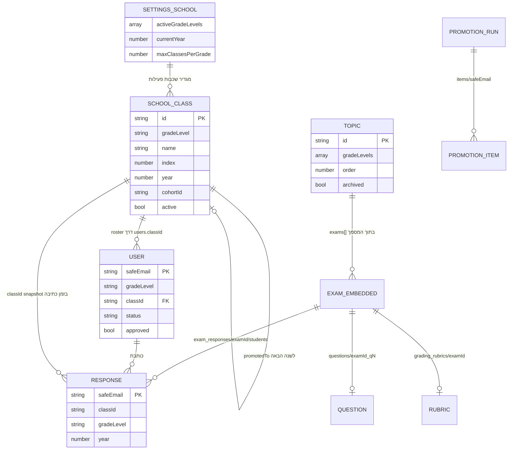
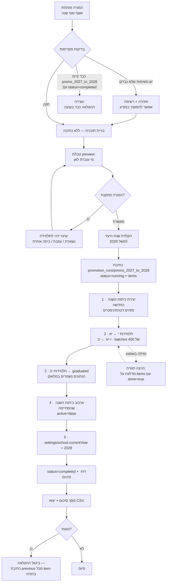

# תוכנית: שכבות (י / יא / יב) וכיתות — מסמך תכנון מלא

**מצב:** תכנון בלבד. שום קוד לא שונה. הקובץ הזה הוא ההוראה המלאה למימוש.
**פרויקט:** `exams-a93fb` · `app.html` (10,854 שורות) · Firestore compat SDK v10 · ללא build step.
**נכתב מול הקוד:** כל הפניה לשורה מתייחסת ל-`app.html` כפי שהוא בעת כתיבת המסמך.

---

## תוכן

1. [מצב קיים](#1-מצב-קיים)
2. [מודל היעד](#2-מודל-היעד)
3. [שיוך משימות](#3-שיוך-משימות)
4. [סכמת Firestore מלאה](#4-סכמת-firestore-מלאה)
5. [חוקי אבטחה](#5-חוקי-אבטחה)
6. [מיגרציה](#6-מיגרציה)
7. [תהליך העלאת כיתה (סוף שנה)](#7-תהליך-העלאת-כיתה-סוף-שנה)
8. [חוויית המורה (UX)](#8-חוויית-המורה-ux)
9. [תוכנית יישום](#9-תוכנית-יישום)
10. [מקרי קצה](#10-מקרי-קצה)
11. [החלטות פתוחות](#11-החלטות-פתוחות)

---

## 1. מצב קיים

### 1.1 מלכודת השמות — `classes` הוא **נושאי לימוד**, לא כיתות

זו הבעיה הראשונה שצריך לפתור. באוסף `classes` יושבים **נושאים** (משתנים, לולאות, מערכים, עצים בינאריים…). אין היום שום ישות שמייצגת כיתה בית-ספרית.

גרוע מזה — גם ה-UI מבלבל: המודאל בשורה 9291 נקרא "עריכת כיתה" / "הוספת כיתה" אבל עורך נושא לימוד; והקומפוננטה נקראת `ClassForm` (שורה 10263) ובתוכה שדה בשם "שכבת גיל".

**מה נשבר אם נוסיף כיתות בלי לטפל בשם:** כל `db.collection('classes')` (4 מופעים), הכלל `match /classes/{classId}` ב-`firestore.rules`, `seed.js`, וכל משתני הסטייט `classes` / `filteredClasses` / `selectedClass` — כולם יתייחסו לשני מושגים שונים באותו שם. כל באג עתידי יעלה פי שניים זמן.

**ההחלטה:** לא לשנות את שם האוסף `classes` עכשיו (ראו §9 שלב 7 — שינוי שם הוא מהלך נפרד ואופציונלי, בסוף). במקום זה:

- אוסף חדש בשם **`school_classes`** לכיתות האמיתיות — שם שאי אפשר לבלבל.
- בקוד: קבוע `const TOPICS_COLLECTION = 'classes';` ליד `EDITOR_EMAIL` (שורה 448), וכל שימוש עובר דרכו. ברגע שנרצה לשנות שם, זו שורה אחת ועוד מיגרציה.
- שמות משתנים: `topics` / `topic` לנושא, `schoolClass` / `classId` לכיתה. לא לערבב.

### 1.2 היכן יושבת לוגיקת השכבה היום

| מה | שורות | הערה |
|---|---|---|
| `EDITOR_EMAIL` | 448 | חשבון המורה היחיד; מקביל ל-`isTeacher()` ב-`firestore.rules` |
| `DataService.loadClasses` | 791 | טוען את כל הנושאים, `orderBy('order')` עם fallback |
| `saveUserProfile(email, name, grade)` | 826 | יוצר/מעדכן `users/{safeEmail}`; ברישום ראשון `approved:false` |
| `setStudentApproval` / `deleteUserProfile` / `loadUserProfile` | 850 / 858 / 867 | |
| `promoteAllStudents(from,to)` | 882 | batch יחיד; **אין חלוקה ל-500**; שומר `promotedFrom`, `promotedAt` |
| `undoPromotion` | 899 | מחזיר רק מי שיש לה `promotedFrom` |
| `graduateGrade` / `undoGraduation` | 921 / 940 | `graduated:true` — ארכיון תלמידות |
| `gradeCounts` | 958 | סופר יא/יב/הועלו/סיימו — קורא את כל `users` |
| `loadAllStudents` | 975 | **מסנן החוצה** תלמידות עם `graduated` וללא `grade` |
| `loadStudentScores` | 989 | סורק את כל `exam_responses` וכל `homework_responses` — N+1 קריאות |
| `saveClass` | 1039 | `set()` מלא, **בלי merge** — דורס את כל מסמך הנושא |
| `addNotification` / `loadNotifications` / `deleteNotification` | 1067–1093 | אוסף `notifications` עם שדה `grade` |
| `GRADE_YA_KEYWORDS` + `topicGradeFor(title)` | 1905–1909 | שיוך שכבה אוטומטי לפי מילות מפתח בכותרת |
| `PendingApprovalScreen` | 3933 | מסך "ממתינה לאישור" |
| `StudentNameScreen` | 3961 | **רישום ראשוני** — כאן התלמידה בוחרת שכבה. כרגע `['יא','יב']` קשיח (שורה 3980) |
| state `studentGrade` | 6380 | |
| state `teacherGradeFilter` | 6458 | ברירת מחדל `'הכל'` |
| סינון התראות לפי שכבה | 6512–6517 | לפי `n.grade === studentGrade` או `'הכל'` |
| טעינת ממתינות לאישור | 6620–6623 | |
| `handleApproveStudent` | 6626 | אישור = `approved:true`; דחייה = **מחיקת המסמך** |
| שמירת נושא (handler) | 6757–6768 | |
| `seedBuiltinTopics` | 6775–6795 | משתמש ב-`topicGradeFor` (שורות 6726, 6786) |
| `archiveClasses(gradeSel,name,year)` | 6843 | מארכב נושאים לפי `c.grade` |
| `restoreClass` / `archiveOneClass` | 6856 / 6863 | |
| `openStudentsReport` | 7217 | |
| `responseGrade` | 7232 | ציון סופי / ידני / חישוב AI |
| `buildDetailedReport` | 7246 | gradebook לפי נושא; שומר `grade: cls.grade` |
| `openDashboard` | 7292 | מסנן `classMatchesGrade(c, teacherGradeFilter)` (7298); סופר `gradeCount = {'י':0,'יא':0,'יב':0}` (7315) |
| `exportReportCSV` | 7322 | עמודה "כיתה" = `s.grade` |
| **`classMatchesGrade(cls, grade)`** | 7459 | לב הסינון |
| `GRADE_ORDER = {'י':0,'יא':1,'יב':2}` | 7466 | **כבר מכיר את י** |
| `isPastTopic` / `studentSeesClass` | 7467 / 7473 | תלמידה רואה את השכבה שלה + שנה אחת אחורה (אפור) |
| `filteredClasses` | 7480 | |
| שער רישום / שער אישור | 7385–7400 | |
| תג שם התלמידה בהדר | 7596–7602 | מציג את השכבה בסוגריים |
| **פקד השכבות בהדר** | 7638–7650 | `['הכל','יא','יב']` קשיח |
| תפריט ניהול | 7662–7686 | "העלאת שכבה (יא ← יב)", "ארכיון שכבות", "ניקוי סוף שנה" |
| מודאל העלאת שכבה | 7691–7724 | |
| מודאל יצירת נושאים מובנים | 7726–7749 | מציג `[['יא',…],['יב',…]]` קשיח |
| מודאל אישור תלמידות | 7753–7770 | מציג "כיתה {s.grade}", כפתורי אישור/דחייה בלבד |
| לוח הגשות למורה | 8910 | רשימת מגישות; **אין סינון לפי כיתה** |
| דף בית למורה | 9111 | קלף "נושאים · {teacherGradeFilter}" (9116) |
| מודאל עריכת נושא | 9291 | `<ClassForm>` |
| מודאל לוח בקרה | 9336+ | |
| מודאל ארכיון | 9576 | `<ArchiveManager>` (10009) |
| **דוח ציונים** | 9597–9750 | פילטר שכבה `['הכל','יא','יב']` (9610); תצוגת סיכום לפי `['י','יא','יב']` (9686) |
| מודאל ניקוי סוף שנה | 9751 | **מוחק את כל התשובות** |
| מודאל עריכת שם | 9849 | `<NameEditForm>` (10753) — בורר `['יא','יב']` קשיח |
| `ClassForm` (עורך נושא) | 10263 | בורר `[['יא'],['יב'],['הכל']]` קשיח |

### 1.3 ממצאים שחשוב לדעת לפני שמתחילים

1. **`notifications` חסום לחלוטין.** האוסף בשימוש (שורות 1067–1093) אבל **אין לו כלל ב-`firestore.rules`** — ולכן ברירת המחדל `match /{document=**} { allow read, write: if false; }` חוסמת אותו. השגיאות נבלעות ב-`catch`. פיצ'ר ההתראות לתלמידות פשוט לא עובד בפרודקשן. יש לתקן בכל מקרה (§5).
2. **`saveClass` דורס.** `set(cleanData)` בלי `{merge:true}` (שורה 1057). שתי לשוניות פתוחות = אובדן עדכון. מסך המטריצה של §8.5 **חייב** להשתמש ב-`update({gradeLevels})` ולא ב-`saveClass`.
3. **`promoteAllStudents` לא מחולק ל-500.** עם 60 תלמידות זה עובד; מעל 500 זה נשבר בשקט. התהליך החדש (§7) מחלק.
4. **`visible:false` הוא קוסמטי בלבד.** מערך `exams` יושב בתוך מסמך הנושא, וכל מי שמחוברת קוראת את המסמך כולו. גם `questions/{examId}_q{n}` פתוח לכל מי שמחוברת. **מסקנה מחייבת:** "משימה גלויה לכיתה X" הוא סינון תצוגה, לא גבול אבטחה. ראו החלטה פתוחה ה' (§11).
5. **`GRADE_ORDER` כבר כולל י** (7466), `openDashboard` כבר סופר י (7315) והדוח כבר מציג י (9686) — אבל אף בורר בממשק לא מאפשר לבחור י. הוספת י היא בעיקר עבודת UI וקונפיגורציה.
6. **חוקי התשובות בודקים את שדה `email`, לא את מזהה המסמך.** לכן מזהי מסמך חלופיים כמו `{safeEmail}__2027` כבר מותרים בלי לגעת בחוקים — נשתמש בזה למקרה "תלמידה חוזרת על שנה" (§10.1).

---

## 2. מודל היעד

### 2.1 תמונת הישויות



### 2.2 ההחלטות המרכזיות

#### א. שכבה פעילה = קונפיגורציה, לא קבוע בקוד

מסמך יחיד **`settings/school`** מחזיק `activeGradeLevels: ['י','יא','יב']`, `currentYear`, `currentYearLabel`, `maxClassesPerGrade`.

**למה מסמך אחד ולא אוסף:** הוא נקרא בכל טעינת עמוד ע"י כל משתמשת (גם לפני אישור) — מסמך אחד = קריאה אחת, כלל אבטחה אחד, ואפשר להחזיק אותו ב-state ולהעביר דרך context.

**מה קורה כששכבה מכובה:** מסתירים, לא מארכבים, ולעולם לא מוחקים. `activeGradeLevels` הוא **פילטר תצוגה בלבד** — הכיתות והתלמידות של אותה שכבה נשארות בדיוק כפי שהן, ה-`active` שלהן לא משתנה. **למה הסתרה ולא ארכוב:** ארכוב הוא שינוי מצב על עשרות מסמכים שצריך לבטל בשנה שאחריה; הסתרה היא שינוי איבר אחד במערך, הפיך במאה אחוז, ואי אפשר לאבד בו נתונים.

#### ב. כיתה = מסמך באוסף `school_classes`, תחום לשנה אחת

מזהה דטרמיניסטי: `sc_{year}_{gradeCode}_{index}` כאשר `gradeCode ∈ {g10, g11, g12}` (י=10, יא=11, יב=12). למשל `sc_2027_g11_2` = יא'2 של תשפ״ז.

**למה דטרמיניסטי:** גם המיגרציה וגם תהליך העלאת הכיתה משתמשים ב-`set(..., {merge:true})` על מזהה שניתן לחשב מראש — ולכן **הרצה כפולה היא no-op**. עם `Date.now()` (כפי שנוצרים היום נושאים, שורה 6763) אי אפשר להשיג אידמפוטנטיות.

**למה מסמך לכל שנה ולא מסמך שנודד בין שכבות:** על מסמך התשובה שומרים `classId` כ-snapshot (§3.4). אילו מסמך הכיתה היה נודד (י'1 הופך ליא'1 באותו מסמך), כל הדוחות ההיסטוריים היו משנים שם בכל סוף שנה. עם מסמך לשנה, המצביע ההיסטורי מצביע לנצח על "י'1 תשפ״ז". הרצף בין השנים נשמר ב-`cohortId` (זהה לאורך שלוש השנים) וב-`promotedFromClassId` / `promotedToClassId`, כך ש"לראות את הכיתה הזאת לאורך שלוש שנים" נשאר שאילתה אחת.

#### ג. שיוך תלמידה לכיתה יושב על `users`, ולא ברשימה על מסמך הכיתה

`users/{safeEmail}.classId` הוא **מקור האמת היחיד**. על מסמך הכיתה יש רק `studentCount` — מספר מייעץ לתצוגה, לא נתון קובע.

**למה לא מערך roster על מסמך הכיתה:**

- כל אישור/העברה של תלמידה היה דורש טרנזקציה על מסמך משותף — קוד מסובך יותר בלי תמורה.
- תלמידה חייבת לדעת מה הכיתה שלה. אם ה-roster הוא מקור האמת, היא חייבת לקרוא את המסמך שמכיל את **רשימת כל חברותיה** — כלומר לחשוף שמות. עם `classId` על הפרופיל שלה היא קוראת מסמך אחד: את שלה.
- מגבלת 1MB: לא בעיה מעשית ב-30 תלמידות, אבל אין סיבה להתקרב.

**דפוסי השאילתה שנובעים מזה:**

| מי | מה רוצה | השאילתה |
|---|---|---|
| מורה | כל תלמידות כיתה | `users.where('classId','==',id).where('status','==','active')` |
| מורה | כל תלמידות שכבה | `users.where('gradeLevel','==','יא').where('status','==','active')` |
| מורה | ממתינות לאישור | `users.where('status','==','pending')` |
| תלמידה | הפרופיל שלה | `users.doc(safeEmail).get()` — מסמך אחד |
| תלמידה | הנושאים שלה | `classes.where('gradeLevels','array-contains','יא').where('archived','==',false).orderBy('order')` |
| כולן | רשימת כיתות (לרישום ולתצוגה) | `school_classes.where('year','==',2027).where('active','==',true)` |

**אילוצי Firestore שהמודל מכבד:**

- **אין join.** כל שדה שמסננים לפיו חייב לשבת על המסמך עצמו — מכאן ה-denormalization של `classId` / `gradeLevel` על `users` ועל מסמכי התשובות.
- **`in` מוגבל ל-30 ערכים.** לא מתקרבים: מקסימום 3 שכבות × ~4 כיתות = 12. חשוב לא להשתמש ב-`in` על רשימת אימיילים של תלמידות — שם המספר לא חסום. לכן דוחות מסננים לפי `classId` (ערך יחיד), לא לפי רשימת תלמידות.
- **`array-contains` — פעם אחת בשאילתה**, ולא ניתן לשלב עם `array-contains-any`. לכן `gradeLevels` על הנושא נשאל ב-Firestore, ואילו `assignedTo.classIds` של המשימה מסונן **בזיכרון** (המשימות ממילא יושבות בתוך מסמך הנושא שכבר נטען).
- **1MB למסמך.** מסמך הנושא הוא היחיד שמתקרב (מכיל `lesson` + `exams[]` + `questions[]`). `assignedTo` מוסיף ~120 בתים למשימה — זניח, אך ראו §10.11.

#### ד. `status` מחליף את ערבוב הדגלים

היום מצב תלמידה מקודד בשלושה מקומות: `approved` (bool), `graduated` (bool אופציונלי), ו"קיים / לא קיים" (דחייה = מחיקת המסמך, שורה 6628). זה מייצר מצבים לא-חוקיים ומוחק נתונים.

**חדש:** `status: 'pending' | 'active' | 'graduated' | 'left'`.

- `approved` **נשאר** ונכתב במקביל (`approved === (status !== 'pending')`) לאורך חלון התאימות — הכללים הקיימים והלקוח הישן מסתמכים עליו.
- דחיית תלמידה תהיה `status:'left'` במקום מחיקה, כדי שלא יימחקו נתונים בטעות. מחיקה אמיתית נשארת ככפתור נפרד ומפורש.

#### ה. נראות נושא לפי שכבות — מערך במקום מחרוזת

היום לנושא יש שדה יחיד `grade: 'יא' | 'יב' | 'הכל'`. זה לא מאפשר "לולאות נלמד גם בי וגם ביא".

**חדש:** `gradeLevels: ['י','יא']` — מערך מפורש של שכבות שרואות את הנושא.

| החלטה | מה נבחר | למה |
|---|---|---|
| מערך או שדה בוליאני לכל שכבה | מערך `gradeLevels` | `array-contains` נותן שאילתה אחת ואינדקס אחד; שדות נפרדים היו דורשים שאילתה לכל שכבה |
| מה המשמעות של "כל השכבות" | **מערך מלא ומפורש** `['י','יא','יב']` | מערך ריק היה דו-משמעי ("אף אחת" או "כולן"?), והשאילתה `array-contains` לא הייתה מחזירה אותו כלל. כפתור "כל השכבות" ב-UI פשוט מסמן את כל התיבות |
| מה עם הערך הישן `grade` | נשאר, נכתב במקביל בחלון התאימות, נמחק בסוף | הלקוח שכבר טעון אצל תלמידה במכשיר עדיין קורא אותו |

**המרה מהישן:**

```js
// ממיר בקריאה (הלקוח החדש) וגם במיגרציה (הסקריפט)
const topicGradeLevels = (topic, activeGradeLevels) => {
  if (Array.isArray(topic.gradeLevels) && topic.gradeLevels.length) return topic.gradeLevels;
  if (topic.grade === 'הכל' || !topic.grade) return [...activeGradeLevels];
  return [topic.grade];
};
```

**מה קורה ל-`classMatchesGrade` (7459) ו-`studentSeesClass` (7473):**

```js
// מחליף את classMatchesGrade — למורה (סינון לפי בורר השכבה בהדר)
const topicInGradeScope = (topic, gradeScope) =>
  gradeScope === 'הכל' || topicGradeLevels(topic, activeGradeLevels).includes(gradeScope);

// מחליף את studentSeesClass — לתלמידה: השכבה שלה + שנה אחת אחורה
const GRADE_ORDER = { 'י': 0, 'יא': 1, 'יב': 2 };            // כבר קיים, שורה 7466
const studentSeesTopic = (topic, myGrade) => {
  const gls = topicGradeLevels(topic, activeGradeLevels);
  if (!myGrade) return true;
  const mine = GRADE_ORDER[myGrade];
  return gls.some(g => GRADE_ORDER[g] === mine || GRADE_ORDER[g] === mine - 1);
};
// "נושא משנה קודמת" — מוצג אפור וקטן. מחליף את isPastTopic (7467)
const isPastTopic = (topic, myGrade) => {
  const gls = topicGradeLevels(topic, activeGradeLevels);
  const mine = GRADE_ORDER[myGrade];
  return mine !== undefined
      && !gls.some(g => GRADE_ORDER[g] === mine)
      &&  gls.some(g => GRADE_ORDER[g] <  mine);
};
```

**מה קורה ל-`topicGradeFor` / `GRADE_YA_KEYWORDS` (1905–1909):** הפונקציה נשארת, משנה שם ל-`suggestGradeLevels(title)` ומחזירה **מערך**. היא הופכת ל**הצעה בזמן יצירת נושא בלבד** — לעולם לא אמת בזמן ריצה. מסך "יצירת נושאי לימוד מובנים" (7726–7749) יציג את ההצעה כמטריצת תיבות סימון שאפשר לשנות **לפני** היצירה, במקום לשייך אוטומטית ובלי לשאול (כפי שקורה היום בשורות 6726 ו-6786).

```js
const GRADE_HINTS = {
  'י':  ['משתנ', 'קלט', 'פלט', 'תנא', 'לולא'],
  'יא': ['מחרוז', 'מערכ', 'מחלק', 'אובייקט', 'עצמים', 'פונקצ', 'מתוד'],
  'יב': ['רשימ', 'מקושר', 'תור', 'מחסנית', 'רקורס', 'עץ', 'עצים', 'בינאר'],
};
const suggestGradeLevels = (title, activeGradeLevels) => {
  const hit = Object.entries(GRADE_HINTS)
    .filter(([g, kws]) => activeGradeLevels.includes(g) && kws.some(k => (title||'').includes(k)))
    .map(([g]) => g);
  return hit.length ? hit : [...activeGradeLevels];   // לא יודעים? מציעים הכול, והמורה תצמצם
};
```

**איך זה מתחבר לשיוך משימות (§3):** שתי שכבות של סינון, ובכוונה:

1. **נושא → שכבות** (`gradeLevels`) — "האם בכלל רלוונטי שהיא תראה את הנושא הזה". גס, יציב, משתנה פעם בשנה.
2. **משימה → כיתות** (`assignedTo`) — "האם המבחן הזה שייך לכיתה שלה, ומתי". עדין, משתנה שבועית.

הכלל: **משימה לעולם לא מוצגת לתלמידה אם הנושא שלה לא גלוי לשכבתה** — סינון הנושא גובר. אם מורה משייכת משימה לכיתה י'1 בתוך נושא שגלוי רק ליא, ה-UI יציג אזהרה אדומה: "המשימה משויכת לכיתה י'1 אבל הנושא לא גלוי לשכבה י — אף תלמידה לא תראה אותה", עם כפתור "הוסיפי את שכבה י לנושא".

#### ו. סיווג עצמי של התלמידה ברישום

התלמידה בוחרת בעצמה בעת ההרשמה הראשונה: שכבה, ואם לשכבה הזו הוגדרה יותר מכיתה אחת — גם כיתה. הבחירה שלה **תמיד** דורשת אישור מורה, והמורה יכולה לתקן אותה לפני האישור.

| שדה על `users` | מי כותב | מתי |
|---|---|---|
| `selfDeclaredGradeLevel`, `selfDeclaredClassId` | התלמידה | פעם אחת, ברישום (ולאחר מכן ניתן לעדכון כל עוד `approved === false`) |
| `gradeLevel`, `classId` | התלמידה ברישום, **המורה** מכאן והלאה | המורה מתקנת באישור, ובכל העברה |
| `approved`, `status` | המורה בלבד | |

**למה שומרים גם את מה שהיא הצהירה וגם את מה שנקבע:** אם המורה תיקנה — נשאר תיעוד של מה הבחורה חשבה, וזה מסביר טעויות אחר כך ("היא רשמה י'3 אבל אין כזאת").

**מה מותר לה לשנות לבד ומתי:**

- **לפני אישור** (`approved === false`): כן — שם, שכבה, כיתה. היא עוד לא ברשימה של אף כיתה, אז אין נזק, וזה חוסך למורה פניות של "טעיתי, תתקני לי".
- **אחרי אישור:** לא. שכבה וכיתה נעולות בכללי האבטחה — רק המורה. שם: כן (היום זה כבר מותר דרך `NameEditForm`, שורה 10753).

**מקסימום כיתות לשכבה:** ברירת מחדל 3 (`settings/school.maxClassesPerGrade`), **אבל זה ערך ניתן לשינוי ולא קבוע בקוד** — המורה הזכירה "י4", ולכן ה-UI לא חוסם ב-3 אלא בערך שבקונפיגורציה, ומאפשר לה להעלות אותו במסך ניהול הכיתות. גבול עליון קשיח: 9 (מעבר לזה מזהה המסמך `sc_2027_g10_10` מפר את מיון ה-`index` בתצוגה, וזו ממילא לא כיתה של מורה אחת).

---

## 3. שיוך משימות

### 3.1 ההחלטה: משימה משויכת ל**שכבה** כברירת מחדל, עם אפשרות לצמצם ל**כיתות** ספציפיות

שלוש אפשרויות נשקלו:

| אפשרות | יתרון | חיסרון | פסק |
|---|---|---|---|
| רק לפי שכבה | הכי פשוט | לא פותר "שתי כיתות נבחנות בזמנים שונים" — דרישה מפורשת | לא מספיק |
| שכבה + רשימת כיתות מפורשת + חריגות לכל כיתה | מכסה 100% מהצרכים, בלי שכפול תוכן | שדה אחד יותר מורכב | **נבחר** |
| מופע נפרד של המשימה לכל כיתה (שכפול) | הפרדה מלאה | משכפל `questions/{examId}_qN`, `exam_settings/{examId}`, `grading_rubrics/{examId}` **ואת כל תת-אוסף התשובות**; הסרגל מתמלא ב"מבחן לולאות — י'1 / י'2 / י'3"; `buildDetailedReport` (7246) מניח שמשימה = עמודה אחת בגיליון הציונים | נדחה |

**הנימוק המכריע נגד שכפול:** כל התוכן והציונים תלויים ב-`examId` יחיד. שכפול לכיתה מכפיל ארבעה אוספים ושובר את גיליון הציונים.

### 3.2 השדות החדשים על `exams[]` (בתוך מסמך הנושא)

```jsonc
{
  "id": "exam_1719...",
  "title": "מבחן לולאות",
  "type": "exam",
  "duration": 60,
  "visible": true,                 // נשאר — מתג ראשי "מוסתר מכולן"

  "assignedTo": {
    "mode": "grade",               // 'grade' | 'classes'  — מפורש, כדי שמערך ריק לא יהיה דו-משמעי
    "gradeLevels": ["יא"],         // רלוונטי כש-mode==='grade': כל הכיתות של השכבות האלה
    "classIds": []                 // רלוונטי כש-mode==='classes': רשימה מפורשת
  },

  "schedule": {                    // אופציונלי לגמרי. אין schedule = התנהגות של היום
    "default": { "openAt": null, "dueAt": null },
    "byClass": {
      "sc_2027_g11_1": { "openAt": "2027-01-12T08:00:00.000Z", "dueAt": "2027-01-12T09:30:00.000Z" },
      "sc_2027_g11_2": { "openAt": "2027-01-13T08:00:00.000Z", "dueAt": "2027-01-13T09:30:00.000Z", "visible": false }
    }
  },

  "year": 2027,                    // השנה שבה המשימה הוקצתה — לסינון דוחות (§7.4)
  "questions": [ /* ללא שינוי */ ]
}
```

`mode` הוא מפורש בכוונה: מערך `classIds` ריק ב-`mode:'classes'` פירושו "עדיין לא שויכה לאף כיתה" (ה-UI יסמן אותה כטיוטה), ואילו `mode:'grade'` עם `classIds` ריק פירושו "כל הכיתות בשכבה". בלי `mode` היינו צריכים לנחש.

### 3.3 פונקציית הסינון — מקום אחד, שני תפקידים

```js
// האם הכיתה הזו מקבלת את המשימה?
const examTargetsClass = (exam, schoolClass) => {
  const a = exam.assignedTo;
  if (!a) return true;                                     // משימה ישנה = לכולם (תאימות לאחור)
  if (a.mode === 'classes') return (a.classIds || []).includes(schoolClass.id);
  return (a.gradeLevels || []).includes(schoolClass.gradeLevel);
};

// מה התלמידה רואה בסרגל הנושאים
const studentSeesExam = (exam, me /* {gradeLevel, classId} */, now = Date.now()) => {
  if (exam.visible === false) return false;
  const per = exam.schedule?.byClass?.[me.classId];
  if (per?.visible === false) return false;
  const openAt = per?.openAt ?? exam.schedule?.default?.openAt;
  if (openAt && now < Date.parse(openAt)) return false;     // עדיין לא נפתח
  const a = exam.assignedTo;
  if (!a) return true;
  if (a.mode === 'classes') return (a.classIds || []).includes(me.classId);
  return (a.gradeLevels || []).includes(me.gradeLevel);
};

// מה המורה רואה — לפי בורר השכבה/כיתה בהדר
const teacherSeesExam = (exam, scope /* {gradeLevel|'הכל', classId|null} */) => {
  if (scope.classId) return examTargetsClass(exam, classById[scope.classId]);
  if (scope.gradeLevel === 'הכל') return true;
  const a = exam.assignedTo;
  if (!a) return true;
  if (a.mode === 'classes')
    return (a.classIds || []).some(id => classById[id]?.gradeLevel === scope.gradeLevel);
  return (a.gradeLevels || []).includes(scope.gradeLevel);
};
```

**נקודות מגע בקוד:** הסינון הזה נכנס לשני מקומות שבהם היום נעשה `(cls.exams || []).filter(...)` — הסרגל הנייד (סביב שורה 7790) והסרגל הרגיל (סביב 7887), וכן `topicStat` (7494) שסופר משימות לכרטיס הנושא. **חשוב:** למורה במצב "כתלמידה" (`previewMode`) הסינון חייב לרוץ עם הכיתה שנבחרה בהדר, אחרת התצוגה משקרת לה.

### 3.4 הקשר הכיתה על מסמך התשובה — snapshot, לא lookup

לכל מסמך ב-`exam_responses/{examId}/students/{safeEmail}` ו-`homework_responses/...` נוספים ארבעה שדות בזמן הכתיבה:

```jsonc
{
  "gradeLevel": "יא",
  "classId":    "sc_2027_g11_1",
  "className":  "יא'1",
  "year":       2027
}
```

**למה snapshot ולא לשלוף מהפרופיל בזמן הדוח — שלוש סיבות, כל אחת מספיקה לבדה:**

1. **נכונות היסטורית.** אחרי העלאת כיתה, `users.classId` של אותה תלמידה מצביע על כיתת יב. שליפה חיה הייתה מתייקת רטרואקטיבית את המבחן שהיא עשתה ביא תחת יב — והדוח של השנה שעברה היה משתנה בכל סוף שנה.
2. **עלות.** דוח על 60 תלמידות × 20 משימות הוא 1,200 מסמכי תשובה. שליפת פרופיל לכל אחד = מאות קריאות נוספות (או קאש בזיכרון שצריך לתחזק). Firestore הוא בלי join — לכן זה בהכרח N קריאות.
3. **סינון בשרת.** בלי השדה על המסמך אי אפשר בכלל לשאול `where('classId','==',id)` על תת-אוסף התשובות. עם השדה — זו שאילתה אחת עם אינדקס אחד.

**מי כותב, ואיך מונעים זיוף:** הלקוח כותב את הערכים מהפרופיל שלו. כללי האבטחה (§5) אוכפים:

- **ביצירה** (`create`, פעם אחת לכל תלמידה×משימה): נבדק מול הפרופיל בפועל בעזרת `get()` — כך שאי אפשר לרשום את עצמך לכיתה אחרת.
- **בעדכון** (`update`, השמירה האוטומטית שרצה כל כמה שניות): ארבעת השדות **חסינים לשינוי** — כל שינוי בהם מותר למורה בלבד. אין `get()` בנתיב הזה.

זו הפרדה מכוונת: ה-`get()` היקר משולם פעם אחת לכל משימה, ולא בכל הקשה במקלדת. יש לכך גם משמעות בכללים — ראו §5.4.

**נקודות מגע בקוד:** `saveStudentAnswer` (1176), `submitExam` (1236), `logExamExit` (1262) — כל אחת מהן בונה אובייקט ושומרת. נוסיף מקור אחד:

```js
// מחושב פעם אחת אחרי טעינת הפרופיל, נשמר ב-state
const classSnapshot = () => ({
  gradeLevel: profile.gradeLevel || profile.grade || null,
  classId:    profile.classId || null,
  className:  classById[profile.classId]?.name || null,
  year:       schoolSettings.currentYear,
});
```

---

## 4. סכמת Firestore מלאה

מקרא: **NEW** אוסף/שדה חדש · **CHANGED** קיים ומשתנה · **UNCHANGED** ללא שינוי.

### 4.1 מפת האוספים

| אוסף | מצב | תפקיד |
|---|---|---|
| `settings/school` | **NEW** | קונפיגורציית בית הספר: שכבות פעילות, שנה נוכחית, מקסימום כיתות |
| `school_classes/{classId}` | **NEW** | כיתות בית-ספריות אמיתיות |
| `promotion_runs/{runId}` + `items/{safeEmail}` | **NEW** | יומן ריצה של העלאת כיתה, כולל undo |
| `classes/{topicId}` | **CHANGED** | נושאי לימוד (השם מטעה — ראו §1.1). נוסף `gradeLevels`, ולכל משימה `assignedTo` |
| `users/{safeEmail}` | **CHANGED** | פרופיל תלמידה. נוספו `gradeLevel`, `classId`, `status`, `year`, `classHistory` |
| `exam_responses/{examId}/students/{safeEmail}` | **CHANGED** | נוספו `classId`, `gradeLevel`, `className`, `year` |
| `homework_responses/{examId}/students/{safeEmail}` | **CHANGED** | זהה |
| `notifications/{id}` | **CHANGED** | מקבל כלל אבטחה (היום חסום — §1.3.1) + `classIds` אופציונלי |
| `questions/{examId}_q{n}` | UNCHANGED | תוכן שאלה |
| `exam_settings/{examId}` | UNCHANGED | `homeworkPrompt` |
| `grading_rubrics/{examId}` | UNCHANGED | מחוון — מורה בלבד |

### 4.2 `settings/school` — NEW

| שדה | טיפוס | תיאור |
|---|---|---|
| `activeGradeLevels` | `string[]` | תת-קבוצה של `['י','יא','יב']`. **לעולם לא ריק** |
| `currentYear` | `number` | השנה הלועזית שבה **מסתיימת** שנת הלימודים (תשפ״ז → 2027) |
| `currentYearLabel` | `string` | `'תשפ״ז'` — לתצוגה בלבד |
| `maxClassesPerGrade` | `number` | ברירת מחדל 3; ניתן לשינוי ע"י המורה; תקרה קשיחה 9 |
| `gradeOrder` | `map` | `{'י':0,'יא':1,'יב':2}` — נשמר כדי שהוספת שכבה עתידית לא תדרוש שינוי קוד |
| `updatedAt`, `updatedBy` | `string` | |

```json
{
  "activeGradeLevels": ["י", "יא", "יב"],
  "currentYear": 2027,
  "currentYearLabel": "תשפ״ז",
  "maxClassesPerGrade": 3,
  "gradeOrder": { "י": 0, "יא": 1, "יב": 2 },
  "updatedAt": "2026-09-01T06:12:00.000Z",
  "updatedBy": "motiml77@gmail.com"
}
```

### 4.3 `school_classes/{classId}` — NEW

מזהה: `sc_{year}_{gradeCode}_{index}` · `gradeCode ∈ {g10,g11,g12}` · `index` מ-1.

| שדה | טיפוס | תיאור |
|---|---|---|
| `id` | `string` | זהה למזהה המסמך (נוחות — כמו בשאר האוספים כאן) |
| `gradeLevel` | `'י'\|'יא'\|'יב'` | |
| `name` | `string` | `"י'1"` — לתצוגה, ניתן לשינוי חופשי ע"י המורה |
| `index` | `number` | 1..N — סדר תצוגה וברירת מחדל לשם |
| `year` | `number` | שנת הלימודים של הכיתה |
| `yearLabel` | `string` | `'תשפ״ז'` |
| `cohortId` | `string` | זהות הקבוצה לאורך השנים — נשמר בהעלאת כיתה |
| `active` | `boolean` | `false` = הועברה לארכיון (סוף שנה או ידנית) |
| `studentCount` | `number` | מייעץ בלבד. מקור האמת: ספירת `users` |
| `promotedFromClassId` | `string\|null` | |
| `promotedToClassId` | `string\|null` | |
| `graduated` | `boolean` | `true` אחרי סיום יב |
| `createdAt`, `createdBy`, `archivedAt`, `archivedReason` | | |

```json
{
  "id": "sc_2027_g11_2",
  "gradeLevel": "יא",
  "name": "יא'2",
  "index": 2,
  "year": 2027,
  "yearLabel": "תשפ״ז",
  "cohortId": "cohort_b",
  "active": true,
  "studentCount": 18,
  "promotedFromClassId": "sc_2026_g10_2",
  "promotedToClassId": null,
  "graduated": false,
  "createdAt": "2026-09-01T06:15:00.000Z",
  "createdBy": "motiml77@gmail.com",
  "archivedAt": null,
  "archivedReason": null
}
```

### 4.4 `users/{safeEmail}` — CHANGED

`safeEmail = email.replace(/[.@]/g,'_')` — ללא שינוי.

| שדה | מצב | טיפוס | הערה |
|---|---|---|---|
| `email`, `name`, `registeredAt`, `approvedAt`, `updatedAt` | UNCHANGED | | |
| `grade` | **CHANGED** | `string` | **deprecated.** נכתב במקביל בחלון התאימות, נמחק בשלב 6 |
| `gradeLevel` | **NEW** | `'י'\|'יא'\|'יב'` | מחליף את `grade` |
| `classId` | **NEW** | `string\|null` | `null` = טרם שויכה (חוקי ומטופל — §10.3) |
| `year` | **NEW** | `number` | שנת הלימודים הנוכחית שלה |
| `status` | **NEW** | `'pending'\|'active'\|'graduated'\|'left'` | |
| `approved` | **CHANGED** | `boolean` | נשמר לתאימות; `approved === (status !== 'pending')` |
| `graduated`, `graduatedAt` | UNCHANGED | | נשמרים לתאימות עם `loadAllStudents` (975) |
| `promotedFrom`, `promotedAt` | UNCHANGED | | |
| `selfDeclaredGradeLevel` | **NEW** | `string\|null` | מה שהיא בחרה ברישום |
| `selfDeclaredClassId` | **NEW** | `string\|null` | |
| `classHistory` | **NEW** | `array` | append-only, ≤4 רשומות. `[{year, gradeLevel, classId, className, from}]` |
| `lastPromotionRunId` | **NEW** | `string\|null` | לאידמפוטנטיות ולביטול (§7.6) |

**אין `className` על `users` בכוונה.** שם הכיתה מוצג תמיד מתוך מסמך הכיתה (רשימה קצרה שממילא נטענת פעם אחת), כדי ששינוי שם כיתה יתעדכן מיידית בכל מקום ולא יידרש תיקון של עשרות מסמכים. ה-snapshot הקפוא של השם נשמר **רק** על מסמכי התשובות, שם הוא חייב להיות היסטורי.

```json
{
  "email": "dana.levi@gmail.com",
  "name": "דנה לוי",
  "grade": "יא",
  "gradeLevel": "יא",
  "classId": "sc_2027_g11_2",
  "year": 2027,
  "status": "active",
  "approved": true,
  "selfDeclaredGradeLevel": "יא",
  "selfDeclaredClassId": "sc_2027_g11_1",
  "classHistory": [
    { "year": 2026, "gradeLevel": "י",  "classId": "sc_2026_g10_2", "className": "י'2",  "from": "registration" },
    { "year": 2027, "gradeLevel": "יא", "classId": "sc_2027_g11_2", "className": "יא'2", "from": "promotion:promo_2026_to_2027" }
  ],
  "lastPromotionRunId": "promo_2026_to_2027",
  "registeredAt": "2025-09-02T07:40:00.000Z",
  "approvedAt": "2025-09-02T18:03:00.000Z"
}
```

> שימו לב ל-`selfDeclaredClassId` שונה מ-`classId`: היא בחרה יא'1, המורה העבירה אותה ליא'2.

### 4.5 `classes/{topicId}` (נושאי לימוד) — CHANGED

| שדה | מצב | הערה |
|---|---|---|
| `id`, `title`, `icon`, `order`, `lesson`, `archived`, `archiveName`, `archiveYear` | UNCHANGED | |
| `grade` | **CHANGED** | deprecated, נכתב במקביל בחלון התאימות |
| `gradeLevels` | **NEW** | `string[]` מפורש |
| `exams[].assignedTo` | **NEW** | `{ mode, gradeLevels[], classIds[] }` |
| `exams[].schedule` | **NEW** | אופציונלי — `{ default:{openAt,dueAt}, byClass:{ [classId]: {openAt,dueAt,visible} } }` |
| `exams[].year` | **NEW** | השנה שבה הוקצתה |
| `exams[].visible`, `.id`, `.title`, `.type`, `.duration`, `.questions` | UNCHANGED | |

```json
{
  "id": "class_1719000000_2",
  "title": "לולאות",
  "icon": "📚",
  "grade": "יא",
  "gradeLevels": ["י", "יא"],
  "order": 2,
  "archived": false,
  "exams": [
    {
      "id": "exam_1719300000",
      "title": "מבחן לולאות",
      "type": "exam",
      "duration": 60,
      "visible": true,
      "year": 2027,
      "assignedTo": { "mode": "classes", "gradeLevels": [], "classIds": ["sc_2027_g11_1", "sc_2027_g11_2"] },
      "schedule": {
        "default": { "openAt": null, "dueAt": null },
        "byClass": {
          "sc_2027_g11_2": { "openAt": "2027-01-13T06:00:00.000Z", "dueAt": "2027-01-13T07:30:00.000Z" }
        }
      },
      "questions": [ { "number": 1, "title": "לולאת while", "points": 50, "questionType": "code" } ]
    },
    {
      "id": "hw_1719400000",
      "title": "תרגול לולאות",
      "type": "homework",
      "visible": true,
      "year": 2027,
      "assignedTo": { "mode": "grade", "gradeLevels": ["י", "יא"], "classIds": [] },
      "questions": [ { "number": 1, "title": "סכום", "points": 100, "questionType": "code" } ]
    }
  ]
}
```

### 4.6 `exam_responses` / `homework_responses` — CHANGED

```json
{
  "email": "dana.levi@gmail.com",
  "studentName": "דנה לוי",
  "examType": "exam",
  "gradeLevel": "יא",
  "classId": "sc_2027_g11_2",
  "className": "יא'2",
  "year": 2027,
  "answers": { "1": { "code": "for (int i=0;i<n;i++) ..." } },
  "submitted": true,
  "submittedAt": "2027-01-13T07:22:11.000Z",
  "lastSaved": "2027-01-13T07:22:11.000Z",
  "pasteAttempts": [],
  "exitAttempts": [],
  "checkedByAI": true,
  "finalGrade": 92,
  "sentToStudent": true
}
```

ארבעת השדות החדשים **קפואים אחרי היצירה** — רק המורה יכולה לשנות אותם (§5). `finalGrade` ו-`sentToStudent` נשארים מורה-בלבד בדיוק כמו היום.

### 4.7 `promotion_runs/{runId}` + `items` — NEW

מזהה דטרמיניסטי: `promo_{fromYear}_to_{toYear}` — ולכן הרצה שנייה מזהה את עצמה ולא מכפילה.

```json
{
  "id": "promo_2027_to_2028",
  "fromYear": 2027, "toYear": 2028,
  "fromYearLabel": "תשפ״ז", "toYearLabel": "תשפ״ח",
  "status": "completed",
  "startedAt": "2027-06-28T09:00:00.000Z",
  "finishedAt": "2027-06-28T09:00:41.000Z",
  "startedBy": "motiml77@gmail.com",
  "counts": { "classesCreated": 3, "studentsMoved": 38, "graduated": 14, "classesArchived": 5, "skipped": 2 },
  "errors": []
}
```

```json
// promotion_runs/promo_2027_to_2028/items/dana_levi_gmail_com
{
  "email": "dana.levi@gmail.com",
  "name": "דנה לוי",
  "action": "promote",
  "fromGradeLevel": "יא", "toGradeLevel": "יב",
  "fromClassId": "sc_2027_g11_2", "toClassId": "sc_2028_g12_2",
  "done": true,
  "doneAt": "2027-06-28T09:00:22.000Z",
  "previous": { "gradeLevel": "יא", "classId": "sc_2027_g11_2", "year": 2027, "status": "active" }
}
```

`previous` הוא **רשומת הביטול**: undo פירושו פשוט לכתוב אותה בחזרה (§7.6). `action ∈ {'promote','graduate','skip','repeat'}`.

### 4.8 `notifications/{id}` — CHANGED

נוסף `classIds: string[]` (ריק = כל הכיתות של `grade`), ו-`gradeLevels: string[]` שמחליף את `grade`. וחשוב מזה — נוסף לו כלל אבטחה, כי היום הוא חסום לגמרי.

### 4.9 אינדקסים

היום אין `firestore.indexes.json` בפרויקט, ו-`firebase.json` לא מפנה לאחד. יש להוסיף את המפתח:

```jsonc
// firebase.json  →  בתוך "firestore"
{ "firestore": { "rules": "firestore.rules", "indexes": "firestore.indexes.json" } }
```

Firestore יוצר אינדקס חד-שדי לכל שדה אוטומטית; להלן רק האינדקסים המורכבים הנדרשים.

```json
{
  "indexes": [
    {
      "collectionGroup": "users",
      "queryScope": "COLLECTION",
      "fields": [
        { "fieldPath": "classId", "order": "ASCENDING" },
        { "fieldPath": "status", "order": "ASCENDING" },
        { "fieldPath": "name", "order": "ASCENDING" }
      ]
    },
    {
      "collectionGroup": "users",
      "queryScope": "COLLECTION",
      "fields": [
        { "fieldPath": "gradeLevel", "order": "ASCENDING" },
        { "fieldPath": "status", "order": "ASCENDING" },
        { "fieldPath": "name", "order": "ASCENDING" }
      ]
    },
    {
      "collectionGroup": "users",
      "queryScope": "COLLECTION",
      "fields": [
        { "fieldPath": "status", "order": "ASCENDING" },
        { "fieldPath": "registeredAt", "order": "ASCENDING" }
      ]
    },
    {
      "collectionGroup": "school_classes",
      "queryScope": "COLLECTION",
      "fields": [
        { "fieldPath": "year", "order": "ASCENDING" },
        { "fieldPath": "active", "order": "ASCENDING" },
        { "fieldPath": "gradeLevel", "order": "ASCENDING" },
        { "fieldPath": "index", "order": "ASCENDING" }
      ]
    },
    {
      "collectionGroup": "school_classes",
      "queryScope": "COLLECTION",
      "fields": [
        { "fieldPath": "cohortId", "order": "ASCENDING" },
        { "fieldPath": "year", "order": "ASCENDING" }
      ]
    },
    {
      "collectionGroup": "classes",
      "queryScope": "COLLECTION",
      "fields": [
        { "fieldPath": "gradeLevels", "arrayConfig": "CONTAINS" },
        { "fieldPath": "archived", "order": "ASCENDING" },
        { "fieldPath": "order", "order": "ASCENDING" }
      ]
    },
    {
      "collectionGroup": "students",
      "queryScope": "COLLECTION_GROUP",
      "fields": [
        { "fieldPath": "classId", "order": "ASCENDING" },
        { "fieldPath": "submitted", "order": "ASCENDING" }
      ]
    },
    {
      "collectionGroup": "students",
      "queryScope": "COLLECTION_GROUP",
      "fields": [
        { "fieldPath": "year", "order": "ASCENDING" },
        { "fieldPath": "classId", "order": "ASCENDING" }
      ]
    }
  ],
  "fieldOverrides": []
}
```

הערות:

- שני האינדקסים האחרונים הם **collection group** על `students` — הם מאפשרים "כל ההגשות של כיתה י'1 בכל המשימות" בשאילתה אחת, במקום הסריקה N+1 שקיימת היום ב-`loadStudentScores` (989). זו לא דרישה לשלב 1, אבל היא הופכת את דוח הכיתה למיידי, ולכן שווה להגדיר מראש.
- שאילתת collection group על `students` מחייבת גם כלל אבטחה בצורת `match /{path=**}/students/{sid}` — ראו §5. **זו הסיבה שמומלץ לדחות אותה לשלב 5** ולא לפתוח אותה לפני שהכללים נבדקו.
- **בנייתו של אינדקס אורכת דקות** על אוסף קיים. יש לפרסם את האינדקסים ולוודא שהם `Enabled` בקונסולה **לפני** שהקוד שמשתמש בהם עולה לאוויר, אחרת השאילתות נכשלות עם `failed-precondition`. שימו לב ש-`loadClasses` (791) כבר מכיל fallback לדפוס הזה — כדאי לחקות אותו בכל שאילתה חדשה.

---

## 5. חוקי אבטחה

### 5.1 מה חייב להישמר מהמצב הקיים

1. תלמידה קוראת וכותבת **רק** את המסמכים שלה.
2. `finalGrade` ו-`sentToStudent` — מורה בלבד, גם ביצירה וגם בעדכון.
3. `grading_rubrics` — מורה בלבד, קריאה וכתיבה.
4. תלמידה לא יכולה לאשר את עצמה (`approved`).
5. `allow list` על `users` — מורה בלבד.

### 5.2 מה נוסף

6. תלמידה **לא** יכולה לשנות את `gradeLevel` / `classId` שלה אחרי שאושרה. לפני האישור — כן (היא עוד לא ברשימה של אף כיתה, וזה חוסך פניות "טעיתי").
7. תלמידה **לא** יכולה לרשום את עצמה לכיתה שלא קיימת, שאינה פעילה, או ששייכת לשכבה אחרת מזו שבחרה.
8. ה-snapshot של הכיתה על מסמך התשובה נבדק מול הפרופיל **ביצירה**, וקפוא לחלוטין בעדכונים.
9. תלמידה **לא** רואה את רשימת חברותיה לכיתה. `users` נשאר `list`-מורה-בלבד, ואין roster במסמך הכיתה.
10. `notifications` מקבל כלל (היום חסום לגמרי — §1.3.1).
11. `settings/school` ו-`school_classes` ניתנים לקריאה לכל מי שמחוברת — **כולל לפני אישור**, כי בלי זה אי אפשר למלא את בוררי הרישום.

### 5.3 שיקול תאימות קריטי

הכללים חייבים לעבוד גם עבור **הלקוח הישן שכבר טעון** בדפדפן של תלמידה. הלקוח הישן:

- יוצר `users` בלי `gradeLevel`/`classId`/`status` → הכללים מתירים היעדר שדות.
- יוצר מסמכי תשובה **בלי** `classId`/`gradeLevel` → בדיקת ה-snapshot פועלת רק אם השדות קיימים.

בלי ההתחשבות הזו, פרסום הכללים היה מנתק כל תלמידה עם לשונית פתוחה — כולל באמצע מבחן.

### 5.4 מגבלות שחייבים לזכור

| מגבלה | ערך | ההשלכה כאן |
|---|---|---|
| `get()` / `exists()` לבקשת מסמך יחיד | 10 | הנתיב הכבד ביותר (יצירת פרופיל) עושה עד 3 — בשוליים נוחים |
| `get()` / `exists()` לקריאה מרובת-מסמכים, טרנזקציה או **batch** | 20 **לכל ה-batch** | **קריטי:** תהליך העלאת הכיתה כותב batches של 500 עדכוני `users`. אילו כלל ה-`update` היה מבצע `get()` לכל מסמך, ה-batch היה נכשל אחרי 20 מסמכים. לכן `isTeacher()` הוא **התנאי הראשון** בכל `\|\|` — הוא נכון ומקצר את ההערכה לפני כל `get()`. **אין לשנות את סדר התנאים.** |
| גודל ה-ruleset | 256KB טקסט | הקובץ שלהלן ~9KB |
| עומק `match` מקונן | 10 | בשימוש: 3 |
| זמן הערכה | מוגבל | אין לולאות; כל הפונקציות O(1) |

### 5.5 `firestore.rules` המלא (מוכן להדבקה)

```javascript
rules_version = '2';

// ============================================================================
//  כללי אבטחה ל-Firestore — אתר "Java לבגרות"  ·  גרסת שכבות + כיתות
//
//  העלאה: Firebase Console → exams-a93fb → Build → Firestore Database
//          → לשונית Rules → הדבקת כל הקובץ → Publish.
//
//  עיקרון: הבדיקה "מורה/תלמידה" בקוד היא לתצוגה בלבד. האבטחה האמיתית כאן.
//
//  ⚠️ סדר התנאים משמעותי: isTeacher() תמיד ראשון בכל || — הוא מקצר את
//     ההערכה לפני כל get(), וכך batch של 500 עדכונים לא חורג מ-20 קריאות.
// ============================================================================

service cloud.firestore {
  match /databases/{database}/documents {

    // ---------------- עזרי הרשאה ----------------
    function isSignedIn() {
      return request.auth != null;
    }

    // חשבון המורה היחיד. אם מחליפים אימייל — לעדכן גם כאן וגם בקוד (EDITOR_EMAIL, שורה 448).
    function isTeacher() {
      return isSignedIn()
        && request.auth.token.email == 'motiml77@gmail.com'
        && request.auth.token.email_verified == true;
    }

    function ownsIncoming() {
      return isSignedIn() && request.resource.data.email == request.auth.token.email;
    }
    function ownsExisting() {
      return isSignedIn() && resource.data.email == request.auth.token.email;
    }

    // אילו שדות השתנו בעדכון הזה
    function changed(keys) {
      return request.resource.data.diff(resource.data).affectedKeys().hasAny(keys);
    }

    // מזהה המסמך של הפרופיל = האימייל עם . ו-@ מוחלפים ב-_  (זהה ל-safeEmail בקוד)
    function mySafeEmail() {
      return request.auth.token.email.replace('[.@]', '_');
    }
    function myProfile() {
      return get(/databases/$(database)/documents/users/$(mySafeEmail())).data;
    }

    function schoolSettings() {
      return get(/databases/$(database)/documents/settings/school).data;
    }

    // ---------------- קונפיגורציית בית הספר ----------------
    // כל מי שמחוברת קוראת (גם לפני אישור — בלי זה אי אפשר למלא את בוררי הרישום).
    match /settings/{docId} {
      allow read:  if isSignedIn();
      allow write: if isTeacher();
    }

    // ---------------- כיתות בית-ספריות ----------------
    // קריאה לכל מי שמחוברת: התלמידה צריכה את רשימת הכיתות כדי לבחור בהרשמה,
    // ואת שם הכיתה שלה לתצוגה. אין כאן שמות תלמידות — רק שם הכיתה.
    match /school_classes/{classId} {
      allow read: if isSignedIn();

      // מספר הכיתות בשכבה נאכף כאן דרך index (index חייב להיות ≤ maxClassesPerGrade).
      allow create: if isTeacher()
                    && request.resource.data.index is int
                    && request.resource.data.index >= 1
                    && request.resource.data.index <= schoolSettings().maxClassesPerGrade
                    && request.resource.data.gradeLevel in ['י', 'יא', 'יב'];

      allow update: if isTeacher();

      // מחיקה רק של כיתה ריקה. כיתה עם תלמידות מארכבים (active:false), לא מוחקים.
      allow delete: if isTeacher() && resource.data.get('studentCount', 0) == 0;
    }

    // ---------------- יומן העלאת כיתה ----------------
    match /promotion_runs/{runId} {
      allow read, write: if isTeacher();
      match /items/{itemId} {
        allow read, write: if isTeacher();
      }
    }

    // ---------------- תוכן לימודי: נושאים, שאלות, הגדרות ----------------
    // ⚠️ האוסף classes מחזיק נושאי לימוד, לא כיתות. ראו docs/plan-grades-classes.md §1.1
    match /classes/{topicId} {
      allow read:  if isSignedIn();
      allow write: if isTeacher();
    }

    match /questions/{questionId} {
      allow read:  if isSignedIn();
      allow write: if isTeacher();
    }

    match /exam_settings/{examId} {
      // מחזיק את ה-prompt לשיעורי בית (שהתלמידה צריכה לבדיקה עצמית).
      allow read:  if isSignedIn();
      allow write: if isTeacher();
    }

    // מחוון הבדיקה — למורה בלבד. תלמידות לעולם לא קוראות אותו.
    match /grading_rubrics/{examId} {
      allow read, write: if isTeacher();
    }

    // התראות על משימה חדשה. (בגרסה הקודמת האוסף הזה לא הופיע כאן ולכן היה חסום.)
    match /notifications/{notifId} {
      allow read:  if isSignedIn();
      allow write: if isTeacher();
    }

    // ---------------- פרופילי תלמידות ----------------

    // השכבה שנבחרה קיימת ופעילה; הכיתה שנבחרה קיימת, פעילה, ושייכת לאותה שכבה.
    // שדות חסרים מותרים — הלקוח הישן שעדיין טעון אצל תלמידות לא שולח אותם.
    function pickedGradeLevel() { return request.resource.data.get('gradeLevel', null); }
    function pickedClassId()    { return request.resource.data.get('classId', null); }

    function validSelfPlacement() {
      return (pickedGradeLevel() == null
              || pickedGradeLevel() in schoolSettings().activeGradeLevels)
          && (pickedClassId() == null
              || (exists(/databases/$(database)/documents/school_classes/$(pickedClassId()))
                  && get(/databases/$(database)/documents/school_classes/$(pickedClassId())).data.active == true
                  && get(/databases/$(database)/documents/school_classes/$(pickedClassId())).data.gradeLevel == pickedGradeLevel()));
    }

    // שדות שרק המורה כותבת — בכל מצב.
    function teacherOnlyUserFields() {
      return ['approved', 'approvedAt', 'status', 'year', 'classHistory',
              'graduated', 'graduatedAt', 'promotedFrom', 'promotedAt',
              'lastPromotionRunId'];
    }
    // שדות שיבוץ — התלמידה יכולה לגעת בהם רק כל עוד לא אושרה.
    function placementFields() {
      return ['gradeLevel', 'classId', 'grade',
              'selfDeclaredGradeLevel', 'selfDeclaredClassId'];
    }

    match /users/{uid} {
      // תלמידה קוראת רק את הפרופיל שלה; המורה קוראת את כולם.
      allow get: if isSignedIn()
                 && (resource == null
                     || isTeacher()
                     || resource.data.email == request.auth.token.email);

      // רשימת תלמידות — למורה בלבד. תלמידה לא רואה את חברותיה לכיתה.
      allow list: if isTeacher();

      // הרשמה ראשונה: המשתמשת עצמה, תמיד לא-מאושרת, ועם שיבוץ חוקי.
      allow create: if isTeacher()
                    || (ownsIncoming()
                        && request.resource.data.approved == false
                        && request.resource.data.get('status', 'pending') == 'pending'
                        && validSelfPlacement());

      allow update: if isTeacher()
                    || (ownsExisting()
                        && ownsIncoming()
                        && !changed(teacherOnlyUserFields())
                        && (resource.data.get('approved', true) == false
                              ? validSelfPlacement()              // עוד לא אושרה — מותר לתקן
                              : !changed(placementFields())));    // אושרה — שיבוץ נעול

      allow delete: if isTeacher();
    }

    // ---------------- תשובות ----------------
    // ה-snapshot של הכיתה נבדק מול הפרופיל ביצירה (פעם אחת לכל משימה),
    // וקפוא לחלוטין בעדכונים — כדי שהשמירה האוטומטית לא תשלם get() בכל הקשה.
    function classSnapshotOk() {
      return !request.resource.data.keys().hasAny(['classId', 'gradeLevel'])
          || (request.resource.data.get('classId', null)    == myProfile().get('classId', null)
              && request.resource.data.get('gradeLevel', null) == myProfile().get('gradeLevel', null));
    }

    // שדות שהתלמידה לא נוגעת בהם לעולם
    function protectedResponseFields() {
      return ['sentToStudent', 'finalGrade', 'manualGrade',
              'classId', 'gradeLevel', 'className', 'year'];
    }

    match /exam_responses/{examId} {
      // המסמך-אב — למורה בלבד.
      allow read, write: if isTeacher();

      match /students/{sid} {
        // קריאה: המורה, או התלמידה את התשובה שלה בלבד.
        allow read: if isTeacher() || resource == null || ownsExisting();

        allow create: if isTeacher()
                      || (ownsIncoming()
                          && !request.resource.data.keys().hasAny(['sentToStudent', 'finalGrade', 'manualGrade'])
                          && classSnapshotOk());

        allow update: if isTeacher()
                      || (ownsExisting() && ownsIncoming()
                          && !changed(protectedResponseFields()));

        allow delete: if isTeacher();
      }
    }

    match /homework_responses/{examId} {
      allow read, write: if isTeacher();

      match /students/{sid} {
        allow read: if isTeacher() || resource == null || ownsExisting();

        allow create: if isTeacher()
                      || (ownsIncoming()
                          && !request.resource.data.keys().hasAny(['sentToStudent', 'finalGrade', 'manualGrade'])
                          && classSnapshotOk());

        allow update: if isTeacher()
                      || (ownsExisting() && ownsIncoming()
                          && !changed(protectedResponseFields()));

        allow delete: if isTeacher();
      }
    }

    // ---------------- שאילתת collection-group על students (שלב 5) ----------------
    // מאפשרת "כל ההגשות של כיתה X בכל המשימות" בשאילתה אחת, למורה בלבד.
    // הכלל מוסיף הרשאה ואינו גורע — נתיבי התלמידה שלמעלה נשארים כפי שהם.
    match /{path=**}/students/{sid} {
      allow read: if isTeacher();
    }

    // ---------------- ברירת מחדל: הכול חסום ----------------
    match /{document=**} {
      allow read, write: if false;
    }
  }
}
```

### 5.6 מה לבדוק ב-Rules Playground לפני פרסום

| תרחיש | תוצאה נדרשת |
|---|---|
| תלמידה מאושרת מנסה `update` על `users` שלה עם `classId` אחר | **דחייה** |
| תלמידה ממתינה (`approved:false`) משנה `classId` לכיתה פעילה של אותה שכבה | אישור |
| תלמידה ממתינה משנה `classId` לכיתה של שכבה אחרת | **דחייה** |
| תלמידה מנסה `create` עם `approved:true` | **דחייה** |
| תלמידה מנסה `list` על `users` | **דחייה** |
| תלמידה יוצרת מסמך תשובה עם `classId` שאינו שלה | **דחייה** |
| תלמידה יוצרת מסמך תשובה **בלי** `classId` (לקוח ישן) | אישור |
| תלמידה מעדכנת תשובה ומנסה לשנות `classId` | **דחייה** |
| תלמידה מעדכנת תשובה ומנסה לכתוב `finalGrade` | **דחייה** |
| תלמידה קוראת `school_classes` לפני שאושרה | אישור |
| מורה מוחקת כיתה עם `studentCount: 5` | **דחייה** |
| מורה יוצרת כיתה עם `index: 4` כש-`maxClassesPerGrade: 3` | **דחייה** |

> **הערה על `replace()`:** הפונקציה `mySafeEmail()` מסתמכת על `String.replace(regex, sub)` בשפת הכללים. יש לוודא ב-Playground שהיא אכן מחליפה את **כל** המופעים (`dana.levi@gmail.com` → `dana_levi_gmail_com`). אם לא — הנפילה האחורית היא לוותר על `classSnapshotOk()` ולהסתמך על תיקון מצד המורה (כפתור "תיקון שיוכי כיתה בתשובות" במסך הדוחות). ההשלכה של הוויתור מוגבלת: תלמידה שתזייף `classId` תזיק לדוח בלבד — היא עדיין לא תוכל לקרוא או לכתוב שום דבר של אחרת.

---

## 6. מיגרציה

### 6.1 עקרונות

1. **תוספתי בלבד.** אף שדה קיים לא נמחק ולא משנה משמעות בשלבים 1–5. `grade`, `approved`, `graduated` נשארים ונכתבים במקביל. לכן **rollback = מחיקת השדות שנוספו**, והלקוח הישן ממשיך לעבוד כאילו כלום.
2. **dry-run קודם, תמיד.** הסקריפט רץ כברירת מחדל ב-`--dry-run` ומדפיס בדיוק מה היה משתנה. כתיבה דורשת `--commit` מפורש.
3. **אידמפוטנטי.** כל מזהה חדש דטרמיניסטי; כל כתיבה היא `set(..., {merge:true})` או `update()` על שדות בודדים. הרצה שנייה לא משנה כלום.
4. **ניתן לחידוש.** כל שלב שומר cursor במסמך `migration_runs/{runId}`. נפילה באמצע → הרצה חוזרת ממשיכה מהמקום.
5. **chunking של 400.** מגבלת Firestore היא 500 כתיבות ל-batch; 400 משאיר מרווח (כל `update` הוא כתיבה אחת, אבל עדכון שמפעיל אינדקסים נספר עדיין כאחד — המרווח הוא ליתר ביטחון ולקריאות הלוג).

### 6.2 סדר השלבים

| שלב | מה | תלוי ב | הפיך |
|---|---|---|---|
| M0 | **גיבוי מלא** — export של כל האוספים ל-JSON מקומי | — | — |
| M1 | יצירת `settings/school` | M0 | כן (מחיקת מסמך) |
| M2 | יצירת כיתת ברירת מחדל אחת לכל שכבה פעילה, לשנה הנוכחית | M1 | כן |
| M3 | backfill ל-`users`: `gradeLevel`, `classId`, `year`, `status`, `classHistory` | M2 | כן |
| M4 | backfill לנושאים: `gradeLevels` מתוך `grade` | M1 | כן |
| M5 | backfill לתשובות היסטוריות: `gradeLevel`, `classId`, `className`, `year` | M3 | כן |
| M6 | שאילתות אימות | M5 | — |
| M7 | *(רק אחרי חלון התאימות)* מחיקת `grade` מ-`users` ומנושאים | פריסה מלאה | לא — לכן אחרון |

### 6.3 פרטי כל שלב

**M1 — `settings/school`.** `activeGradeLevels` נגזר מהנתונים בפועל: השכבות שיש להן תלמידות פעילות או נושאים. בפועל היום `['יא','יב']`. המורה תוסיף `'י'` דרך הממשק כשתרצה. `currentYear` — נשאל בשורת הפקודה (`--year 2027`), אין ניחוש.

**M2 — כיתות ברירת מחדל.** לכל שכבה ב-`activeGradeLevels` נוצרת כיתה אחת: `sc_{year}_{gradeCode}_1` בשם `"יא'1"`, `index:1`, `cohortId: 'cohort_' + gradeCode + '_' + year`. **למה אחת ולא שלוש:** כיתה ריקה היא רעש בממשק; המורה תיצור את השנייה והשלישית בלחיצה אחת כשתצטרך.

**M3 — `users`.** לכל מסמך שאינו של המורה:

```
gradeLevel := d.grade                     (אם אין grade → מדלגים, מדווחים)
classId    := ברירת המחדל של אותה שכבה
year       := currentYear
status     := d.graduated ? 'graduated' : (d.approved === false ? 'pending' : 'active')
classHistory := [{ year, gradeLevel, classId, className, from: 'migration' }]
approved   := נשאר כפי שהוא
grade      := נשאר כפי שהוא
```

**M4 — נושאים.** `gradeLevels := (grade === 'הכל' || !grade) ? [...activeGradeLevels] : [grade]`. **חובה להשתמש ב-`update({gradeLevels})` ולא ב-`set()`** — מסמך הנושא מכיל את `lesson` ואת כל מערך `exams`, ו-`set()` מלא בזמן שהמורה עורכת נושא במקביל ידרוס את עבודתה (זו בדיוק החולשה של `saveClass`, שורה 1057).

**M5 — תשובות היסטוריות.** כאן צריך זהירות: הפרופיל הנוכחי של תלמידה כבר לא בהכרח משקף את השכבה שבה היא הייתה כשהגישה. הסקריפט משתמש בנתונים שכבר קיימים:

```js
// שכבת התלמידה בזמן ההגשה
function gradeAtTime(user, response) {
  const ts = response.submittedAt || response.lastSaved;
  // אם הועלתה שכבה, וההגשה מוקדמת ל-promotedAt — היא הייתה בשכבה הקודמת
  if (user.promotedFrom && user.promotedAt && ts && ts < user.promotedAt) {
    return { gradeLevel: user.promotedFrom, approx: true };
  }
  return { gradeLevel: user.grade || user.gradeLevel, approx: false };
}
```

מסמכים שנקבעו לפי ההיוריסטיקה מסומנים ב-`classSnapshotApprox: true`, כדי שהמורה תדע שדוח היסטורי לפני המעבר הוא הערכה ולא נתון שנרשם בזמן אמת. **מסמכים חדשים לעולם לא יסומנו כך.**

**M6 — אימות.** להריץ ולוודא:

```js
// 1. אין תלמידה פעילה בלי שכבה
users.where('status','==','active').get() → כולן עם gradeLevel
// 2. אין classId שמצביע על כיתה שלא קיימת
// 3. סכום studentCount על הכיתות == מספר התלמידות הפעילות
// 4. כל נושא לא-מארכב עם gradeLevels לא ריק
// 5. ספירת התשובות לפני ואחרי זהה (לא נוצרו/נמחקו מסמכים)
```

### 6.4 חלון התאימות (dual-read / dual-write)

האתר הוא SPA שנטען מ-Vercel. תלמידה עם לשונית פתוחה מריצה את ה-bundle הישן עד שהיא תרענן.

- **קריאה:** הלקוח החדש קורא תמיד `gradeLevel ?? grade` ו-`gradeLevels ?? [grade]`.
- **כתיבה:** הלקוח החדש כותב **את שניהם** — `gradeLevel` וגם `grade`, `status` וגם `approved`.
- **משך:** לפחות שבוע לימודים מלא. **אין לפרסם עדכון באמצע יום מבחנים.** החלון נסגר רק אחרי שהמורה מאשרת שכולן נכנסו לפחות פעם אחת (אפשר לראות זאת ב-`updatedAt` על הפרופילים).
- **M7** (מחיקת `grade`) הוא היחיד שלא הפיך, ולכן רץ אחרון ובנפרד — ובאמת אפשר גם לא להריץ אותו לעולם; שדה מיותר עולה כלום.

### 6.5 שלד הסקריפט

> **לא להריץ מהמסמך הזה.** הקובץ נועד להיווצר כ-`firebase-setup/migrate-classes.js` בשלב המימוש, ולרוץ ידנית מול גיבוי קיים.

```js
/**
 * firebase-setup/migrate-classes.js
 *
 *   node migrate-classes.js --year 2027                    # dry-run (ברירת מחדל)
 *   node migrate-classes.js --year 2027 --only M3          # שלב יחיד
 *   node migrate-classes.js --year 2027 --commit           # כתיבה אמיתית
 *   node migrate-classes.js --year 2027 --commit --resume  # המשך אחרי נפילה
 *   node migrate-classes.js --year 2027 --commit --rollback
 */
const admin = require('firebase-admin');
admin.initializeApp({ credential: admin.credential.cert(require('./serviceAccountKey.json')) });
const db = admin.firestore();

// ---------- ארגומנטים ----------
const argv = process.argv.slice(2);
const flag = (n) => argv.includes('--' + n);
const val  = (n, d) => { const i = argv.indexOf('--' + n); return i >= 0 ? argv[i + 1] : d; };

const DRY      = !flag('commit');
const RESUME   = flag('resume');
const ROLLBACK = flag('rollback');
const YEAR     = parseInt(val('year', ''), 10);
const ONLY     = val('only', null);
const RUN_ID   = `mig_classes_${YEAR}`;
const CHUNK    = 400;                       // מתחת למגבלת 500

if (!YEAR) { console.error('חסר --year'); process.exit(1); }

const GRADE_CODE = { 'י': 'g10', 'יא': 'g11', 'יב': 'g12' };
const TEACHER    = 'motiml77@gmail.com';
const classIdFor = (grade, index, year = YEAR) => `sc_${year}_${GRADE_CODE[grade]}_${index}`;

// ---------- תשתית: לוג, cursor, כתיבה מחולקת ----------
const runRef = db.collection('migration_runs').doc(RUN_ID);

async function loadState() {
  if (!RESUME) return { steps: {} };
  const s = await runRef.get();
  return s.exists ? s.data() : { steps: {} };
}
async function markStep(step, info) {
  if (DRY) return;
  await runRef.set({ id: RUN_ID, year: YEAR, updatedAt: new Date().toISOString(),
                     steps: { [step]: { done: true, ...info } } }, { merge: true });
}

/** מבצע רשימת פעולות בקבוצות של CHUNK. כל פעולה: {ref, data, op:'set'|'update'} */
async function commitAll(label, ops) {
  console.log(`  ${DRY ? '[dry-run]' : '[commit] '} ${label}: ${ops.length} מסמכים`);
  if (DRY) { ops.slice(0, 5).forEach(o => console.log('    ·', o.ref.path, JSON.stringify(o.data))); 
             if (ops.length > 5) console.log(`    · … ועוד ${ops.length - 5}`);
             return ops.length; }
  for (let i = 0; i < ops.length; i += CHUNK) {
    const batch = db.batch();
    ops.slice(i, i + CHUNK).forEach(o =>
      o.op === 'update' ? batch.update(o.ref, o.data) : batch.set(o.ref, o.data, { merge: true }));
    await batch.commit();
    console.log(`    ✓ ${Math.min(i + CHUNK, ops.length)}/${ops.length}`);
  }
  return ops.length;
}

// ---------- M1 ----------
async function M1_settings() {
  const users  = await db.collection('users').get();
  const topics = await db.collection('classes').get();
  const found  = new Set();
  users.forEach(d  => { const g = d.data().grade;  if (g && GRADE_CODE[g]) found.add(g); });
  topics.forEach(d => { const g = d.data().grade;  if (g && GRADE_CODE[g]) found.add(g); });
  const active = ['י', 'יא', 'יב'].filter(g => found.has(g));
  if (!active.length) active.push('יא', 'יב');

  return commitAll('settings/school', [{
    op: 'set', ref: db.collection('settings').doc('school'),
    data: { activeGradeLevels: active, currentYear: YEAR,
            currentYearLabel: val('yearLabel', String(YEAR)),
            maxClassesPerGrade: 3, gradeOrder: { 'י': 0, 'יא': 1, 'יב': 2 },
            updatedAt: new Date().toISOString(), updatedBy: TEACHER },
  }]);
}

// ---------- M2 ----------
async function M2_defaultClasses() {
  const s = await db.collection('settings').doc('school').get();
  const active = s.exists ? s.data().activeGradeLevels : ['יא', 'יב'];
  const ops = active.map(g => ({
    op: 'set', ref: db.collection('school_classes').doc(classIdFor(g, 1)),
    data: { id: classIdFor(g, 1), gradeLevel: g, name: `${g}'1`, index: 1,
            year: YEAR, yearLabel: val('yearLabel', String(YEAR)),
            cohortId: `cohort_${GRADE_CODE[g]}_${YEAR}`, active: true, studentCount: 0,
            promotedFromClassId: null, promotedToClassId: null, graduated: false,
            createdAt: new Date().toISOString(), createdBy: TEACHER,
            archivedAt: null, archivedReason: null },
  }));
  return commitAll('school_classes (ברירת מחדל)', ops);
}

// ---------- M3 ----------
async function M3_users() {
  const snap = await db.collection('users').get();
  const ops = [], skipped = [];
  snap.forEach(doc => {
    const d = doc.data();
    if (d.email === TEACHER) return;
    if (d.gradeLevel && d.classId) return;                    // כבר עבר — אידמפוטנטיות
    const g = d.grade;
    if (!g || !GRADE_CODE[g]) { skipped.push(d.email); return; }
    const cid    = classIdFor(g, 1);
    const status = d.graduated ? 'graduated' : (d.approved === false ? 'pending' : 'active');
    ops.push({ op: 'update', ref: doc.ref, data: {
      gradeLevel: g, classId: cid, year: YEAR, status,
      selfDeclaredGradeLevel: d.selfDeclaredGradeLevel || g,
      selfDeclaredClassId:    d.selfDeclaredClassId    || null,
      classHistory: admin.firestore.FieldValue.arrayUnion(
        { year: YEAR, gradeLevel: g, classId: cid, className: `${g}'1`, from: 'migration' }),
    }});
  });
  if (skipped.length) console.log(`  ⚠ ${skipped.length} ללא שכבה — לא שויכו:`, skipped.join(', '));
  return commitAll('users', ops);
}

// ---------- M4 ----------
async function M4_topics() {
  const s = await db.collection('settings').doc('school').get();
  const active = s.exists ? s.data().activeGradeLevels : ['יא', 'יב'];
  const snap = await db.collection('classes').get();
  const ops = [];
  snap.forEach(doc => {
    const d = doc.data();
    if (Array.isArray(d.gradeLevels) && d.gradeLevels.length) return;      // כבר עבר
    const gls = (!d.grade || d.grade === 'הכל') ? [...active] : [d.grade];
    // update ולא set — המסמך מכיל lesson + exams, ו-set היה דורס עריכה מקבילה
    ops.push({ op: 'update', ref: doc.ref, data: { gradeLevels: gls } });
  });
  return commitAll('classes (נושאים)', ops);
}

// ---------- M5 ----------
async function M5_responses() {
  const usersSnap = await db.collection('users').get();
  const byEmail = {}; usersSnap.forEach(d => { byEmail[d.data().email] = d.data(); });
  const classCache = {};
  const nameOf = async (cid) => {
    if (!cid) return null;
    if (!(cid in classCache)) {
      const c = await db.collection('school_classes').doc(cid).get();
      classCache[cid] = c.exists ? c.data().name : null;
    }
    return classCache[cid];
  };

  let total = 0;
  for (const coll of ['exam_responses', 'homework_responses']) {
    const exams = await db.collection(coll).get();
    for (const examDoc of exams.docs) {
      const students = await examDoc.ref.collection('students').get();
      const ops = [];
      for (const sd of students.docs) {
        const r = sd.data();
        if (r.classId) continue;                                // כבר עבר
        const u = byEmail[r.email];
        if (!u) continue;
        const ts = r.submittedAt || r.lastSaved;
        const wasPromoted = u.promotedFrom && u.promotedAt && ts && ts < u.promotedAt;
        const gl  = wasPromoted ? u.promotedFrom : (u.gradeLevel || u.grade);
        const cid = wasPromoted ? classIdFor(u.promotedFrom, 1, YEAR - 1) : (u.classId || null);
        ops.push({ op: 'update', ref: sd.ref, data: {
          gradeLevel: gl || null, classId: cid, className: await nameOf(cid),
          year: wasPromoted ? YEAR - 1 : YEAR,
          classSnapshotApprox: true,
        }});
      }
      total += await commitAll(`${coll}/${examDoc.id}`, ops);
    }
  }
  return total;
}

// ---------- M6 ----------
async function M6_verify() {
  const users = await db.collection('users').get();
  const cls   = await db.collection('school_classes').get();
  const ids   = new Set(cls.docs.map(d => d.id));
  const counts = {};
  let noGrade = 0, badClass = 0, active = 0;
  users.forEach(d => {
    const u = d.data();
    if (u.email === TEACHER) return;
    if (u.status === 'active') {
      active++;
      if (!u.gradeLevel) noGrade++;
      if (u.classId && !ids.has(u.classId)) badClass++;
      if (u.classId) counts[u.classId] = (counts[u.classId] || 0) + 1;
    }
  });
  console.log(`  תלמידות פעילות: ${active} · ללא שכבה: ${noGrade} · classId שבור: ${badClass}`);
  console.log('  ספירה לכיתה:', counts);
  const topics = await db.collection('classes').get();
  const noGl = topics.docs.filter(d => !d.data().archived &&
                 !(Array.isArray(d.data().gradeLevels) && d.data().gradeLevels.length)).length;
  console.log(`  נושאים פעילים ללא gradeLevels: ${noGl}`);
  // מעדכן studentCount לפי הספירה בפועל
  return commitAll('studentCount', cls.docs.map(d => ({
    op: 'update', ref: d.ref, data: { studentCount: counts[d.id] || 0 } })));
}

// ---------- rollback ----------
const ADDED_USER_FIELDS  = ['gradeLevel','classId','year','status','classHistory',
                            'selfDeclaredGradeLevel','selfDeclaredClassId','lastPromotionRunId'];
const ADDED_TOPIC_FIELDS = ['gradeLevels'];
const ADDED_RESP_FIELDS  = ['gradeLevel','classId','className','year','classSnapshotApprox'];

async function rollback() {
  const del = Object.fromEntries; const D = admin.firestore.FieldValue.delete();
  const users = await db.collection('users').get();
  await commitAll('rollback users', users.docs.map(d => ({
    op: 'update', ref: d.ref, data: del(ADDED_USER_FIELDS.map(k => [k, D])) })));
  const topics = await db.collection('classes').get();
  await commitAll('rollback topics', topics.docs.map(d => ({
    op: 'update', ref: d.ref, data: del(ADDED_TOPIC_FIELDS.map(k => [k, D])) })));
  for (const coll of ['exam_responses', 'homework_responses']) {
    const exams = await db.collection(coll).get();
    for (const e of exams.docs) {
      const st = await e.ref.collection('students').get();
      await commitAll(`rollback ${coll}/${e.id}`, st.docs.map(d => ({
        op: 'update', ref: d.ref, data: del(ADDED_RESP_FIELDS.map(k => [k, D])) })));
    }
  }
  console.log('↩ rollback הושלם. school_classes ו-settings/school נשארו — למחוק ידנית אם צריך.');
}

// ---------- main ----------
(async () => {
  console.log(`\n=== מיגרציית שכבות+כיתות · שנה ${YEAR} · ${DRY ? 'DRY-RUN' : 'COMMIT'} ===\n`);
  if (ROLLBACK) { await rollback(); process.exit(0); }
  const state = await loadState();
  const steps = { M1: M1_settings, M2: M2_defaultClasses, M3: M3_users,
                  M4: M4_topics,   M5: M5_responses,      M6: M6_verify };
  for (const [name, fn] of Object.entries(steps)) {
    if (ONLY && ONLY !== name) continue;
    if (RESUME && state.steps?.[name]?.done) { console.log(`▷ ${name} — כבר הושלם, מדלג`); continue; }
    console.log(`▶ ${name}`);
    const n = await fn();
    await markStep(name, { count: n, at: new Date().toISOString() });
  }
  console.log(`\n${DRY ? '(לא נכתב דבר. להרצה אמיתית: --commit)' : '✔ הושלם.'}\n`);
  process.exit(0);
})().catch(e => { console.error('❌', e); process.exit(1); });
```

### 6.6 Rollback

| מה | איך |
|---|---|
| שדות שנוספו ל-`users` / נושאים / תשובות | `--rollback` מוחק אותם ב-`FieldValue.delete()` |
| `school_classes`, `settings/school`, `migration_runs` | אוספים חדשים — מחיקה ידנית מהקונסולה, או פשוט להשאיר (הלקוח הישן מתעלם מהם) |
| כללי אבטחה | לשמור עותק של `firestore.rules` הנוכחי לפני הפרסום ולהחזיר אותו ב-Publish נוסף |
| הלקוח | Vercel שומר את כל הדיפלויים — Rollback בלחיצה אחת מלוח הבקרה |

**סדר החזרה לאחור אם משהו נשבר בפרודקשן:** קודם החזרת הלקוח ב-Vercel (מיידי, מחזיר את האתר לפעולה), אחר כך החזרת הכללים, ורק בסוף — ואם בכלל — `--rollback` על הנתונים. השדות שנוספו לא מפריעים ללקוח הישן, אז אין דחיפות למחוק אותם.

---

## 7. תהליך העלאת כיתה (סוף שנה)

מחליף את "העלאת שכבה (יא ← יב)" הקיים (`promoteAllStudents`, שורה 882; המודאל בשורות 7691–7724), שמעלה את כל תלמידות יא בבת אחת בלי כיתות, בלי preview, בלי יומן, ובלי חלוקה ל-batches.

### 7.1 התרשים



### 7.2 תנאים מקדימים

| בדיקה | התנהגות |
|---|---|
| `settings/school.currentYear` מוגדר | חסימה אם לא |
| לא קיים `promotion_runs/promo_{from}_to_{to}` עם `status:'completed'` | **חסימה** — ההעלאה כבר בוצעה. אם קיים עם `status:'running'` → הצעה לחדש |
| כל המשימות של השנה נבדקו ונשלחו | **אזהרה בלבד**, עם רשימה מדויקת ("3 משימות עם הגשות שלא קיבלו ציון"). המורה יכולה להמשיך במודע — סוף שנה לא תמיד מסתדר לפי הספר |
| לכל שכבה פעילה יש לפחות כיתה אחת | חסימה — אין לאן להעלות |
| אין תלמידות פעילות ללא `classId` | **אזהרה** + הן מסומנות `action: 'skip'` ברשימה |

### 7.3 מה בדיוק קורה לכל ישות

| ישות | פעולה | מה **לא** קורה |
|---|---|---|
| תלמידת י | `gradeLevel: 'יא'`, `classId` → הכיתה היורשת, `year+1`, שורה ל-`classHistory`, `promotedFrom:'י'`, `lastPromotionRunId` | לא נוגעים בתשובות, בציונים ובשם |
| תלמידת יא | זהה, → יב | |
| תלמידת יב | `status:'graduated'`, `graduated:true`, `graduatedAt`. **`classId` ו-`gradeLevel` נשארים כפי שהם** — הם התיעוד ההיסטורי של המחזור שלה | לא נמחקת, לא מאבדת נתונים |
| כיתה של השנה שהסתיימה | `active:false`, `archivedAt`, `promotedToClassId` → היורשת. כיתות יב מקבלות גם `graduated:true` | לא נמחקת לעולם |
| כיתה חדשה | נוצרת עם `promotedFromClassId`, אותו `cohortId`, אותו `index` ו-`name` מותאם (י'2 → יא'2) | |
| תשובות וציונים | **לא נוגעים בהם בכלל** — הם ההיסטוריה. ה-snapshot של `classId`/`year` עליהם כבר מקבע אותם לשנה הנכונה | לא נמחקים. **"ניקוי סוף שנה" (9751) שמוחק את כל התשובות מוצא מהאשף הזה** ונשאר פעולה נפרדת ומסוכנת מאחורי אזהרה |
| נושאים ומשימות | ראו §7.4 | |
| `settings/school` | `currentYear` ו-`currentYearLabel` מתקדמים | `activeGradeLevels` לא משתנה — זו החלטה של המורה |

### 7.4 האם המשימות מתאפסות כל שנה?

**המלצה: לא לשכפל ולא למחוק — לתחום לפי שנה.**

לכל משימה יש `year`. באשף, אחרי ההעלאה, יש שלב אופציונלי "משימות לשנה החדשה" עם שלוש אפשרויות לכל נושא:

1. **פתיחה מחדש (מומלץ, ברירת מחדל)** — אותו `examId` נשאר, ה-`year` שלו מתעדכן ל-2028, ו-`assignedTo` מתעדכן לכיתות החדשות. התשובות של השנה שעברה נשארות בדיוק במקום, מזוהות לפי ה-snapshot `year: 2027`.
2. **השארה מוסתרת** — `visible:false`. המשימה נשארת לצפייה בדוחות ההיסטוריים ולא מוצגת לאף אחת.
3. **ארכוב הנושא כולו** — המנגנון הקיים (`archiveClasses`, שורה 6843) עם `archiveYear`.

**למה לא לשכפל:** `questions/{examId}_q{n}`, `exam_settings/{examId}`, `grading_rubrics/{examId}` וכל תת-אוסף התשובות תלויים ב-`examId` יחיד. שכפול משימה = שכפול של ארבעה אוספים, וגיליון הציונים (`buildDetailedReport`, 7246) מניח משימה = עמודה אחת. המחיר של אי-השכפול הוא מקרה קצה יחיד — תלמידה שחוזרת על השנה ונבחנת שוב באותו מבחן — והוא מטופל ב-§10.1.

### 7.5 אידמפוטנטיות והתאוששות

- **מזהה ריצה דטרמיניסטי** `promo_{fromYear}_to_{toYear}` — הרצה שנייה מוצאת `status:'completed'` ועוצרת עם הודעה, לא בפעולה.
- **מזהי כיתות דטרמיניסטיים** — יצירה חוזרת של `sc_2028_g11_1` היא `set(merge)` על אותו מסמך, כלומר no-op.
- **`items/{safeEmail}` עם `done:true`** — הריצה עוברת רק על מה שעדיין לא `done`. נפילה ברשת באמצע ה-batch השני מ-4 → הרצה חוזרת ממשיכה מ-800.
- **`lastPromotionRunId` על הפרופיל** — הגנה שנייה: אם מסמך תלמידה כבר נושא את מזהה הריצה הנוכחי, הוא לא נגע שוב, גם אם `items` נמחק.
- **סימון `done` באותו batch של העדכון** — `batch.update(userRef, ...)` ו-`batch.update(itemRef, {done:true})` יורדים יחד. אין מצב שבו תלמידה הועלתה אבל לא סומנה. עם 400 תלמידות זה 800 כתיבות → 2 batches; החלוקה היא ל-200 זוגות ל-batch.

### 7.6 ביטול (undo)

לכל `item` יש `previous` — צילום מלא של `{gradeLevel, classId, year, status}` לפני השינוי. ביטול = מעבר על ה-items וכתיבת `previous` בחזרה, וכן:

- מחיקת הכיתות החדשות **רק אם `studentCount === 0`** אחרי ההחזרה (הכלל ב-§5 אוכף זאת גם בשרת).
- החזרת `active:true` לכיתות השנה שהסתיימה.
- החזרת `settings/school.currentYear`.
- `status:'rolled_back'` על מסמך הריצה — הוא **לא נמחק**, כדי שיישאר תיעוד שההעלאה בוצעה ובוטלה.

**חלון הביטול:** האשף מציג את הכפתור "ביטול ההעלאה" בולט למשך 7 ימים מהריצה, ואחר כך מסתיר אותו מאחורי "ארכיון ריצות". הסיבה: אחרי שבוע כבר נכתבו תשובות חדשות עם snapshot של השנה החדשה, וביטול יוצר אי-התאמה שקטה בין הפרופיל לתשובות. הביטול עדיין אפשרי — אבל עם אזהרה מפורשת שסופרת כמה תשובות חדשות נכתבו מאז.

### 7.7 האשף — ארבעה שלבים

```
┌──────────────────────────────────────────────────────────────────┐
│  סוף שנה · תשפ״ז ← תשפ״ח                        ① ─ ② ─ ③ ─ ④   │
├──────────────────────────────────────────────────────────────────┤
│  ① בדיקות                                                        │
│                                                                  │
│   ✓  לכל שכבה פעילה יש כיתה                                      │
│   ✓  לא בוצעה העלאה לשנה הזו                                     │
│   ⚠  3 משימות עם הגשות שלא קיבלו ציון                            │
│        · מבחן לולאות — יא'1 · 4 הגשות                            │
│        · תרגול מערכים — יא'2 · 1 הגשה                            │
│        · מבחן עצים — יב'1 · 7 הגשות              [ פתחי דוח ]    │
│   ⚠  2 תלמידות ללא כיתה — לא ישויכו                              │
│        · נועה כהן (יא) · מיכל דוד (י)          [ שייכי עכשיו ]   │
│                                                                  │
│                                        [ ביטול ]  [ המשך › ]     │
└──────────────────────────────────────────────────────────────────┘

┌──────────────────────────────────────────────────────────────────┐
│  ② תצוגה מקדימה — מי עוברת לאן                                   │
├──────────────────────────────────────────────────────────────────┤
│   י'1  (20 תלמידות)   →   יא'1        ▸ פרטי                     │
│   י'2  (18)           →   יא'2        ▸ פרטי                     │
│   יא'1 (22)           →   יב'1        ▾ פרטי                     │
│        ├ דנה לוי        יא'1 → יב'1      [עוברת ▾]               │
│        ├ שרה כהן        יא'1 → יב'1      [עוברת ▾]               │
│        └ תמר ישראלי     יא'1 → יב'1      [נשארת ▾] ← נשארת ביא'1 │
│   יא'2 (18)           →   יב'2        ▸ פרטי                     │
│   יב'1 (14)           →   🎓 סיום לימודים (ארכיון)  ▸ פרטי       │
│   ללא כיתה (2)        →   ללא שינוי                              │
│                                                                  │
│   סה״כ: 3 כיתות ייווצרו · 78 תלמידות יעברו · 14 יסיימו · 2 ידולגו│
│                                       [ ‹ חזרה ]  [ המשך › ]     │
└──────────────────────────────────────────────────────────────────┘

┌──────────────────────────────────────────────────────────────────┐
│  ③ אישור                                                         │
│                                                                  │
│   הפעולה משנה את השיוך של 92 תלמידות.                            │
│   שום תשובה, ציון או משוב לא יימחק.                              │
│   ניתן לבטל את הפעולה במלואה במשך 7 ימים.                        │
│                                                                  │
│   להמשך, הקלידי את שנת היעד:  [ 2028        ]                    │
│                                       [ ‹ חזרה ]  [ בצעי ]       │
└──────────────────────────────────────────────────────────────────┘

┌──────────────────────────────────────────────────────────────────┐
│  ④ סיכום                                    ✓ ההעלאה הושלמה      │
│                                                                  │
│   כיתות שנוצרו       3      תלמידות שעברו    78                  │
│   סיימו לימודים     14      דולגו             2                  │
│   כיתות שאורכבו      5      שגיאות            0                  │
│                                                                  │
│   השנה הנוכחית עודכנה ל-תשפ״ח (2028).                            │
│                                                                  │
│   [ ⬇ יצוא הדוח ל-CSV ]   [ ↩ ביטול ההעלאה ]   [ סגירה ]         │
└──────────────────────────────────────────────────────────────────┘
```

**"נשארת" בשלב ②** מסמן `action:'repeat'` — התלמידה לא זזה, וה-`items` מתעד את זה. ראו §10.1 להשלכות על התשובות.

---

## 8. חוויית המורה (UX)

עיקרון מנחה אחד: **הכיתה היא ההקשר, לא פילטר נוסף.** המורה בוחרת כיתה פעם אחת בהדר, וכל המסכים — סרגל הנושאים, לוח ההגשות, הדוחות — מתיישרים אליה. אין שישה פילטרים נפרדים כמו היום (בורר בהדר, בורר בדוח, בורר בארכיון, בורר במודאל הנושאים).

### 8.1 בורר שכבה + כיתה בהדר

מחליף את `['הכל','יא','יב']` הקשיח (שורות 7638–7650).

**דסקטופ** — שתי שורות בפקד אחד:

```
┌───────────────────────────────────────────────────────────┐
│  [ כל השכבות ] [ י ] [ יא ]* [ יב ]                       │  ← מ-activeGradeLevels
│  ────────────────────────────────────────────────────     │
│  [ כל הכיתות ]* [ יא'1 · 22 ] [ יא'2 · 18 ]   ⚙ ניהול     │
└───────────────────────────────────────────────────────────┘
```

- שורת הכיתות מופיעה רק כשנבחרה שכבה ספציפית, ורק אם יש בה יותר מכיתה אחת. שכבה עם כיתה אחת → הכיתה נבחרת אוטומטית ולא מוצג פקד מיותר.
- המספר על כל צ'יפ הוא `studentCount` — מיידי, בלי שאילתה.
- ⚙ פותח את "ניהול כיתות" (§8.2).
- הבחירה נשמרת ב-`localStorage` ומשוחזרת בכניסה הבאה. **למה:** המורה מלמדת את אותה כיתה כמה ימים ברצף; לאפס אותה ל"הכל" בכל טעינה זה חיכוך יומיומי.
- שינוי בורר מאפס `selectedExam` / `selectedQuestion` / `viewingStudent` — בדיוק כמו ההתנהגות היום (שורה 7644).

**נייד** — כפתור יחיד שפותח bottom sheet. הפקד הנוכחי בשתי שורות לא נכנס ברוחב טלפון:

```
   הדר:   [ יא'2 ▾ ]          ← 88px, טקסט אחד

   ┌──────────────────────────┐   bottom sheet, נפתח מלמטה
   │  שכבה                    │
   │  ○ כל השכבות             │
   │  ○ י          38 תלמידות │
   │  ● יא         40 תלמידות │
   │  ○ יב         14 תלמידות │
   │  ────────────────────    │
   │  כיתה                    │
   │  ○ כל הכיתות             │
   │  ○ יא'1              22  │
   │  ● יא'2              18  │
   │  ────────────────────    │
   │  [   ⚙ ניהול כיתות   ]   │
   └──────────────────────────┘
```

יעדי מגע ≥44px, גלילה פנימית, סגירה בהחלקה למטה. `data-screen-label="בורר כיתה"` בהתאם למוסכמה הקיימת בקוד.

### 8.2 מסך "ניהול כיתות"

מודאל `wide`, בתפריט הניהול תחת הכותרת "תלמידות וציונים" (ליד "אישור תלמידות חדשות", שורה 7675).

```
┌────────────────────────────────────────────────────────────────────┐
│  ניהול כיתות · תשפ״ז                                          ✕   │
├────────────────────────────────────────────────────────────────────┤
│  שכבות פעילות בשנה זו                                              │
│  [✓] י      [✓] יא     [✓] יב            מקסימום כיתות לשכבה: [3▾] │
│  ℹ כיבוי שכבה מסתיר אותה מהתצוגה בלבד. שום נתון לא נמחק ולא מארכב. │
├────────────────────────────────────────────────────────────────────┤
│  שכבה י                                            [ + הוספת כיתה ]│
│  ┌────────────────────────────────────────────────────────────┐    │
│  │ י'1     20 תלמידות    ● פעילה     [שם] [רשימה] [ארכוב]     │    │
│  │ י'2     18 תלמידות    ● פעילה     [שם] [רשימה] [ארכוב]     │    │
│  └────────────────────────────────────────────────────────────┘    │
│                                                                    │
│  שכבה יא                                           [ + הוספת כיתה ]│
│  ┌────────────────────────────────────────────────────────────┐    │
│  │ יא'1    22 תלמידות    ● פעילה     [שם] [רשימה] [ארכוב]     │    │
│  │ יא'2    18 תלמידות    ● פעילה     [שם] [רשימה] [ארכוב]     │    │
│  │ יא'3     0 תלמידות    ● פעילה     [שם] [רשימה] [מחיקה]     │    │
│  └────────────────────────────────────────────────────────────┘    │
│                                                                    │
│  שכבה יב                                    ⛔ הגעת ל-3 כיתות      │
│  ┌────────────────────────────────────────────────────────────┐    │
│  │ יב'1    14 תלמידות    ● פעילה     …                        │    │
│  │ יב'2    12 תלמידות    ● פעילה     …                        │    │
│  │ יב'3    11 תלמידות    ● פעילה     …                        │    │
│  └────────────────────────────────────────────────────────────┘    │
├────────────────────────────────────────────────────────────────────┤
│  ▸ כיתות מארכבות (7)                                               │
└────────────────────────────────────────────────────────────────────┘
```

- **"מחיקה" מופיע רק לכיתה עם 0 תלמידות.** בכל מצב אחר הכפתור הוא "ארכוב". זה נאכף גם בכללים (§5).
- כיבוי שכבה מציג דיאלוג שמפרט בדיוק מה יוסתר: *"שכבה י תוסתר מהתצוגה: 2 כיתות, 38 תלמידות פעילות, 4 נושאים שגלויים רק לשכבה י. כל הנתונים יישמרו וניתן להחזיר בכל רגע."* אם יש נושא שגלוי **רק** לשכבה הזו, זו אזהרה מודגשת — אחרת הוא ייעלם בשקט מכולן.
- לא ניתן לכבות את השכבה האחרונה שנשארה.

### 8.3 רשימת כיתה (roster)

```
┌────────────────────────────────────────────────────────────────────┐
│  ‹ ניהול כיתות        יא'2 · 18 תלמידות · תשפ״ז               ✕   │
├────────────────────────────────────────────────────────────────────┤
│  [ 🔍 חיפוש… ]        סינון: ( הכל ) ( פעילות ) ( ממתינות )        │
│  ☐ בחירת הכול                     ← בבחירה: [העברה ל…▾] [הסרה]    │
├────────────────────────────────────────────────────────────────────┤
│  ☐  דנה לוי         dana.levi@gmail.com    ממוצע 88   [⋯]         │
│  ☐  שרה כהן         sara@gmail.com         ממוצע 91   [⋯]         │
│  ☐  תמר ישראלי      tamar@gmail.com        ממוצע —    [⋯]         │
│  ☐  נועה ברק        noa@gmail.com          ⏳ ממתינה   [אישור]     │
│                                                                    │
│      [⋯] →  צפייה בהגשות · העברה לכיתה אחרת · סימון "עזבה"         │
└────────────────────────────────────────────────────────────────────┘
```

- שאילתה: `users.where('classId','==',id).where('status','in',['active','pending']).orderBy('name')`.
- **"העברה ל…"** על בחירה מרובה — batch יחיד: עדכון `classId` + `gradeLevel` + שורה ל-`classHistory` + עדכון `studentCount` לשתי הכיתות. הודעת אישור מציינת מפורשות שההגשות הקודמות **נשארות תחת הכיתה הישנה** (ראו §10.4).
- **"הסרה"** = `status:'left'`, לא מחיקה.

### 8.4 אישור תלמידות — עם תיקון שיבוץ

מחליף את המודאל בשורות 7753–7770, שמציג היום רק שם, אימייל ושכבה ושני כפתורים.

```
┌────────────────────────────────────────────────────────────────────┐
│  אישור תלמידות חדשות (3)                                      ✕   │
├────────────────────────────────────────────────────────────────────┤
│  ┌──────────────────────────────────────────────────────────────┐  │
│  │ נועה ברק                                                     │  │
│  │ noa.barak@gmail.com · נרשמה לפני 2 שעות                      │  │
│  │                                                              │  │
│  │ בחרה בעצמה:   שכבה יא · כיתה יא'1                            │  │
│  │ שיבוץ:        [ יא ▾ ]  [ יא'2 ▾ ]   ← שונה מבחירתה ⚠        │  │
│  │                                                              │  │
│  │                              [ דחייה ]   [ אישור ושיבוץ ]    │  │
│  └──────────────────────────────────────────────────────────────┘  │
│  ┌──────────────────────────────────────────────────────────────┐  │
│  │ מיכל דוד                                                     │  │
│  │ michal@gmail.com · נרשמה אתמול                               │  │
│  │ בחרה בעצמה:   שכבה י · ללא כיתה (לא היו כיתות מוגדרות)       │  │
│  │ שיבוץ:        [ י ▾ ]  [ בחרי כיתה ▾ ] ⚠ חובה                │  │
│  │                              [ דחייה ]   [ אישור ושיבוץ ]    │  │
│  └──────────────────────────────────────────────────────────────┘  │
├────────────────────────────────────────────────────────────────────┤
│  [ אישור הכול לפי בחירתן ]                                         │
└────────────────────────────────────────────────────────────────────┘
```

- שני הבוררים ממולאים מהקונפיגורציה, לא קשיחים. שינוי בורר השכבה טוען מחדש את כיתות אותה שכבה.
- **"שונה מבחירתה"** מודגש — זו התראה שקטה למורה שהיא עומדת לעקוף את מה שהתלמידה הצהירה.
- "דחייה" = `status:'left'`, **לא מחיקה** (היום, שורה 6628, זו מחיקת מסמך).
- באישור: `status:'active'`, `approved:true`, `gradeLevel`, `classId`, `approvedAt`, שורה ל-`classHistory`, ו-`studentCount++` על הכיתה.

### 8.5 נראות נושאים — לכל נושא, ובמטריצה

**בעורך הנושא** (`ClassForm`, שורה 10263) — במקום שלושת הכפתורים `[יא][יב][הכל]`, תיבות סימון לפי `activeGradeLevels`:

```
  אילו שכבות רואות את הנושא?
  [✓] י     [✓] יא     [ ] יב            [ בחרי הכול ]
  ℹ נושא יכול להופיע לכמה שכבות. תלמידה רואה גם נושאים של שכבה אחת אחורה, באפור.
```

**מסך המטריצה** — "נראות נושאים לפי שכבה" בתפריט הניהול תחת "תוכן ולמידה":

```
┌────────────────────────────────────────────────────────────────────┐
│  נראות נושאים לפי שכבה                                        ✕   │
├────────────────────────────────────────────────────────────────────┤
│  נושא                              │   י   │   יא  │   יב  │      │
│  ──────────────────────────────────┼───────┼───────┼───────┤      │
│  📚 משתנים, קלט ופלט               │  [✓]  │  [ ]  │  [ ]  │      │
│  📚 תנאים                          │  [✓]  │  [ ]  │  [ ]  │      │
│  📚 לולאות                         │  [✓]  │  [✓]  │  [ ]  │      │
│  📚 מערכים                         │  [ ]  │  [✓]  │  [ ]  │      │
│  📚 מחרוזות                        │  [ ]  │  [✓]  │  [ ]  │      │
│  📚 מחלקות ואובייקטים              │  [ ]  │  [✓]  │  [✓]  │      │
│  📚 רשימות מקושרות                 │  [ ]  │  [ ]  │  [✓]  │      │
│  📚 עצים בינאריים                  │  [ ]  │  [ ]  │  [✓]  │      │
│  ──────────────────────────────────┼───────┼───────┼───────┤      │
│  סימון עמודה שלמה                  │  [∨]  │  [∨]  │  [∨]  │      │
│                                                                    │
│  ⚠ "תור ומחסנית" לא מסומן לאף שכבה — אף תלמידה לא תראה אותו.       │
│                                                                    │
│  3 שינויים לא שמורים          [ ביטול ]      [ שמירה ]             │
└────────────────────────────────────────────────────────────────────┘
```

- שמירה = **batch יחיד של `update({gradeLevels})`** — לא `saveClass` (§1.3.2). הנושאים הם ~12 מסמכים, הרחק מ-500.
- אזהרה על נושא בלי אף שכבה — התקלה השקטה הכי סבירה כאן.
- **בנייד:** המטריצה לא נכנסת. במקום זה — רשימת נושאים, שורה לכל נושא, ובכל שורה קבוצת צ'יפים לחיצים `[י][יא][יב]` שמדליקים/מכבים. אותם נתונים, בלי טבלה אופקית.

### 8.6 סרגל הנושאים ולוח ההגשות

**סרגל הנושאים** (הנייד סביב 7790, הרגיל סביב 7887) — הסינון הופך לדו-שלבי (§3.3). כשנבחרה כיתה ספציפית, כותרת קטנה מעל הרשימה: `יא'2 · 6 נושאים · 11 משימות`. משימה שלא שויכה לאף כיתה מקבלת תג `טיוטה — לא שויכה` בכתום, כדי שלא תישכח.

**לוח ההגשות** (שורה 8910) — היום מציג את כל המגישות ללא הבחנה. תוספת:

```
┌────────────────────────────────────────────────────────────────────┐
│  מבחן לולאות            [מבחן]     משויך ל: יא'1 · יא'2  [שינוי]   │
│  2 שאלות                                                           │
├────────────────────────────────────────────────────────────────────┤
│  ( הכול · 40 )  ( יא'1 · 22 )*  ( יא'2 · 18 )                      │
│                                                                    │
│  התחילו 20   הגישו 18   נבדקו 15   קיבלו ציון 12    ← של יא'1 בלבד │
│                                                                    │
│  ⚠ 2 תלמידות מיא'1 עוד לא התחילו:  תמר ישראלי · רותי בר            │
│                                                                    │
│  [דנה לוי]     ענתה 2/2   הגישה     [צפייה ובדיקה] [מתן ציון]      │
│  …                                                                 │
└────────────────────────────────────────────────────────────────────┘
```

- הצ'יפים מסננים בזיכרון על `r.classId` — התשובות ממילא נטענות במלואן (`loadAllResponses`, 1303).
- **"מי עוד לא התחילה"** הוא הדבר שהכי חסר היום: היום הלוח מציג רק את מי שכבר נגעה במשימה. עם roster לכיתה אפשר סוף סוף להציג את ההפרש. שאילתה אחת נוספת (`users` של הכיתה) שכבר בזיכרון.
- "משויך ל: … [שינוי]" פותח בורר כיתות + לוח זמנים לכל כיתה (השדות מ-§3.2).

### 8.7 דוחות

**דוח ציונים** (9597–9750) — פילטר השכבה הקשיח (9610) הופך לשני בוררים, ותצוגת הסיכום מקובצת לפי כיתה במקום לפי שכבה:

```
  תצוגה: ( סיכום )* ( מפורט לפי נושא ) ( השוואת כיתות )
  שכבה: [ יא ▾ ]     כיתה: [ הכול ▾ ]     שנה: [ תשפ״ז ▾ ]

  📚 יא'1  (22 תלמידות · ממוצע כיתה 84)
  ┌──────────────┬────────────────────┬────────┬────────┬────────┐
  │ שם           │ אימייל             │ מבחנים │ עבודות │ ממוצע  │
  ...
  📚 יא'2  (18 תלמידות · ממוצע כיתה 79)
  ...
```

- **בורר השנה** מסנן על `year` של מסמך התשובה — כך שאחרי העלאת כיתה אפשר לפתוח את הדוח של תשפ״ז ולראות בדיוק את מה שראינו אז, עם שמות הכיתות של אז. זה הרווח המרכזי מה-snapshot (§3.4).
- CSV (`exportReportCSV`, 7322) מקבל עמודות `שכבה` ו-`כיתה` נפרדות, ושם הקובץ כולל את הכיתה והשנה.

**תצוגה שלישית — השוואת כיתות:**

```
┌────────────────────────────────────────────────────────────────────┐
│  השוואת כיתות · שכבה יא · תשפ״ז                                    │
├────────────────────────────────────────────────────────────────────┤
│  משימה              │ יא'1          │ יא'2          │ פער         │
│  ───────────────────┼───────────────┼───────────────┼─────────────│
│  מבחן לולאות        │ 84 (18/22)    │ 79 (16/18)    │  +5         │
│  תרגול מערכים       │ 91 (22/22)    │ 88 (18/18)    │  +3         │
│  מבחן מחרוזות       │ 72 (20/22)    │ 81 (17/18)    │  −9  ⚠      │
│  ───────────────────┼───────────────┼───────────────┼─────────────│
│  ממוצע              │ 82            │ 83            │             │
│                                                                    │
│  (ממוצע · מספר המגישות מתוך הרשומות בכיתה)                         │
└────────────────────────────────────────────────────────────────────┘
```

פער מעל 8 נקודות מסומן — זה הסימן ל"אחת הכיתות לא קיבלה את החומר" והוא בדיוק הדבר שמורה עם שלוש כיתות מחפשת. החישוב הוא בזיכרון על אותם נתונים שכבר נטענו ל-`buildDetailedReport` (7246), עם קיבוץ לפי `r.classId` במקום לפי תלמידה.

### 8.8 רישום התלמידה

`StudentNameScreen` (3961) — במקום `['יא','יב']` הקשיח בשורה 3980:

```
  ┌────────────────────────────────┐
  │        נעים להכיר!             │
  │  [ השם המלא שלך            ]   │
  │                                │
  │  באיזו שכבה את לומדת?          │
  │  [   י   ] [  יא  ] [  יב  ]   │  ← מ-activeGradeLevels
  │                                │
  │  באיזו כיתה?                   │  ← רק אם יש >1 כיתה בשכבה
  │  [ י'1 ] [ י'2 ] [ י'3 ]       │  ← מ-school_classes, active, השנה
  │                                │
  │  [   שליחה לאישור המורה    ]   │
  └────────────────────────────────┘
```

- שכבה עם כיתה אחת → נבחרת אוטומטית, מוצגת כטקסט (`כיתה: י'1`) ולא כבורר.
- שכבה בלי כיתות → הבורר מושמט, `classId: null`, והמורה תשבץ באישור.
- `PendingApprovalScreen` (3933) יציג את מה שבחרה: *"הבקשה שלך (שכבה יא, כיתה יא'1) נשלחה למורה"* + קישור קטן "בחרתי לא נכון? תיקון" שפותח שוב את המסך — אפשרי כי היא עוד `approved:false` (§5.2 סעיף 6).
- `NameEditForm` (10753) אחרי אישור: שדה השם בלבד. במקום הבוררים — שורת טקסט `שכבה יא · כיתה יא'2` עם הערה "לשינוי כיתה — פני למורה". זה תואם לכללי האבטחה, ולא נותן לה לנסות ולהיכשל.

### 8.9 נייד — סיכום ההתאמות

| מסך | ההתאמה |
|---|---|
| בורר שכבה+כיתה | כפתור אחד + bottom sheet (§8.1) |
| ניהול כיתות | כרטיסים מוערמים במקום טבלה; פעולות בתפריט `⋯` |
| מטריצת נראות | רשימה עם צ'יפים לכל שורה, לא טבלה אופקית (§8.5) |
| רשימת כיתה | כרטיס לתלמידה; בחירה מרובה בלחיצה ארוכה |
| דוחות והשוואת כיתות | הטבלאות כבר משתמשות ב-`mobile-hscroll` (שורה 9640) — לשמור על אותה מוסכמה |
| אשף סוף שנה | שלב אחד למסך, מלא-מסך, כפתורים דביקים בתחתית |

---

## 9. תוכנית יישום

הסדר נבנה כך שהאתר החי לא נשבר באף רגע: קודם קונפיגורציה שאף אחד עוד לא משתמש בה, אחר כך קריאה עם fallback, ורק בסוף כתיבה שמסתמכת על המבנה החדש. כל שלב ניתן לשליחה בפני עצמו.

| שלב | מה | קבצים / עוגנים | מאמץ | סיכון |
|---|---|---|---|---|
| 0 | תשתית: גיבוי, `firestore.indexes.json`, פרסום הכללים החדשים (תואמים לאחור), הרצת M1+M2 | `firebase.json`, `firestore.rules`, `firebase-setup/migrate-classes.js` | 0.5 יום | **בינוני** — פרסום כללים משפיע מיד |
| 1 | שכבות כקונפיגורציה + נראות נושא כמערך | 448, 791, 1905–1909, 3961–3990, 7459–7484, 7638–7650, 9610, 9686, 10263–10290, 10753 | 1.5 יום | נמוך |
| 2 | `school_classes` + מסך ניהול כיתות + בורר בהדר | `DataService` (אחרי 1093), 6458, 7638–7650, תפריט 7662–7686, מודאל חדש | 2 ימים | נמוך |
| 3 | סיווג עצמי ברישום + אישור עם תיקון + רשימת כיתה | 826, 850, 3933, 3961, 6620–6630, 7753–7770 | 1.5 יום | בינוני — נוגע בזרימת ההרשמה |
| 4 | שיוך משימות לכיתות + snapshot על התשובות + סינון לוח ההגשות | 1176, 1236, 1262, 6874+, 7790, 7887, 8910, `ExamForm` 10298 | 2.5 ימים | **בינוני-גבוה** — נתיב הכתיבה של התלמידות |
| 5 | דוחות לפי כיתה + השוואת כיתות + M5 | 7217, 7246, 7292, 7322, 9597–9750 | 2 ימים | נמוך |
| 6 | אשף סוף שנה | מחליף 882–955, 7691–7724; `promotion_runs` | 2.5 ימים | **גבוה** — כתיבה המונית |
| 7 | *(אופציונלי)* `classes` → `topics` | כל 4 מופעי `db.collection('classes')`, `firestore.rules`, `seed.js` | 1 יום | בינוני |

**סה״כ ~13.5 ימי עבודה.** שלבים 1–3 נותנים כבר ערך מלא למורה (שכבה י, כיתות, שיבוץ); 4–6 הם העומק.

### 9.1 פירוט לכל שלב

**שלב 0 — תשתית.** גיבוי מלא. הוספת `"indexes"` ל-`firebase.json`. פרסום `firestore.rules` החדשים — **הם תואמים לאחור במלואם** (§5.3), ולכן אפשר לפרסם אותם לפני שהקוד משתנה בכלל. הרצת M1+M2 (`--commit`). המתנה עד שכל האינדקסים `Enabled`.
*בדיקה:* להיכנס לאתר כמורה וכתלמידה, לפתוח מבחן, לשמור תשובה, להגיש. שום דבר לא אמור להשתנות.

**שלב 1 — קונפיגורציה + מערך שכבות.** טעינת `settings/school` ב-`App` ליד טעינת הנושאים (6600–6617) והחזקתה ב-state. החלפת כל מערך שכבות קשיח בקריאה מהקונפיגורציה: 3980 (רישום), 7643 (הדר), 7736 (מודאל נושאים מובנים), 9610 ו-9686 (דוח), 10269 ו-10283 (עורך נושא), 10761 (עריכת שם). החלפת `classMatchesGrade`/`studentSeesClass`/`isPastTopic` (7459–7478) בגרסאות המערך מ-§2.2ה. `topicGradeFor` → `suggestGradeLevels`. הרצת M4. מסך המטריצה (§8.5).
*בדיקה:* הפעלת שכבה י בקונפיגורציה → היא מופיעה בהדר, ברישום ובדוח. סימון "לולאות" לי+יא → תלמידת י רואה אותו. כיבוי שכבה י → הכול נעלם ושום נתון לא השתנה.

**שלב 2 — כיתות.** `DataService` חדש: `loadSchoolClasses`, `saveSchoolClass`, `archiveSchoolClass`, `deleteSchoolClass`, `refreshStudentCount`. state `teacherClassFilter` ליד `teacherGradeFilter` (6458). הבורר בהדר (§8.1), מסך ניהול הכיתות (§8.2).
*בדיקה:* יצירת יא'2, שינוי שם, ניסיון ליצור כיתה רביעית (חסום ב-UI ובכללים), ארכוב, ניסיון מחיקה של כיתה עם תלמידות (חסום).

**שלב 3 — שיבוץ תלמידות.** `saveUserProfile` (826) מקבל `gradeLevel`+`classId`+`selfDeclared*`+`status` וכותב גם את `grade` הישן. `setStudentApproval` (850) הופך ל-`approveStudent(email, {gradeLevel, classId})` שכותב הכול ב-batch אחד ומעדכן `studentCount`. `handleApproveStudent` (6626): דחייה = `status:'left'` במקום `deleteUserProfile`. מסכי §8.3, §8.4, §8.8.
*בדיקה:* הרשמה בחשבון Google נוסף, בחירת שכבה+כיתה, תיקון על ידי המורה, אישור, כניסה — התלמידה רואה את נושאי השכבה שלה. ניסיון של התלמידה לשנות כיתה אחרי אישור — נכשל (Console + UI).

**שלב 4 — משימות ותשובות.** `ExamForm` (10298) מקבל בורר "משויך ל" + לוח זמנים לכל כיתה. `saveExam` (6874) שומר `assignedTo`, `schedule`, `year`. הסינון מ-§3.3 נכנס ל-7790, 7887 ו-`topicStat` (7494). `saveStudentAnswer` (1176), `submitExam` (1236) ו-`logExamExit` (1262) מוסיפים את ה-snapshot. לוח ההגשות (8910) מקבל צ'יפים ואת "מי עוד לא התחילה".
*בדיקה — זה השלב שהכי כדאי לבדוק בזהירות:* משימה לשכבה שלמה, משימה לכיתה אחת, משימה לשתי כיתות עם זמנים שונים. תלמידה מכיתה לא-משויכת לא רואה אותה. **חובה לבדוק שהלקוח הישן (לשונית שנפתחה לפני העדכון) עדיין מצליח לשמור תשובה** — זו הנקודה שבה הכללים החדשים יכולים להפיל תלמידה באמצע מבחן.

**שלב 5 — דוחות.** `buildDetailedReport` (7246) מקבץ לפי `classId`; `openDashboard` (7292) מסנן לפי הכיתה שנבחרה; `exportReportCSV` (7322) מקבל עמודות חדשות; המודאל (9597) מקבל בורר כיתה ובורר שנה ותצוגת השוואה. הרצת M5. אופציונלי: מעבר `loadStudentScores` (989) לשאילתת collection-group — זה מייתר את הסריקה N+1 שהיא היום הדבר האיטי ביותר בדוח.
*בדיקה:* דוח של כיתה, דוח של שכבה, דוח של שנה שעברה — השמות והציונים תואמים למה שהיה.

**שלב 6 — אשף סוף שנה.** `promoteAllStudents` / `undoPromotion` / `graduateGrade` / `undoGraduation` / `gradeCounts` (882–973) מוחלפים ב-`PromotionService` עם `buildPlan`, `execute`, `resume`, `undo`. הכפתור בתפריט (7677) והכפתור בדף הבית (9124) מפנים לאשף. **המודאל הישן (7691–7724) נמחק רק אחרי שהאשף עבד בהצלחה על נתוני אמת.**
*בדיקה:* להריץ preview על הנתונים האמיתיים ולהשוות ידנית; להריץ, לבדוק, לבטל, ולוודא שהכול חזר בדיוק. רק אז להריץ באמת.

**שלב 7 — שינוי שם `classes` → `topics` (אופציונלי).** אם וכאשר:
1. הוספת כלל `match /topics/{topicId}` זהה לכלל של `classes` (שניהם פעילים).
2. סקריפט העתקה `classes` → `topics` (מזהים זהים).
3. הלקוח קורא מ-`topics` עם fallback ל-`classes`, וכותב **לשניהם** — שבוע.
4. הלקוח כותב ל-`topics` בלבד; `classes` הופך ל-read-only.
5. אחרי חודש: מחיקת `classes` והכלל שלו.
**המלצה: לא לעשות את זה עכשיו.** הרווח הוא בהירות בלבד; הסיכון הוא באתר חי באמצע שנה. הקבוע `TOPICS_COLLECTION` (§1.1) נותן 90% מהתועלת בעלות אפס.

### 9.2 מה יהיה כואב בקוד הקיים

| הכאב | למה | ההמלצה |
|---|---|---|
| `saveClass` (1039) עושה `set()` מלא בלי merge | כל שמירת נושא כותבת מחדש `lesson` + כל `exams` + כל `questions`. שתי לשוניות = אובדן. מסך המטריצה ו-M4 חייבים לעקוף אותו | להוסיף `updateClassFields(id, fields)` שעושה `update()`, ולהעביר אליו את כל השמירות של שדה בודד |
| `exams[]` בתוך מסמך הנושא | כל עריכת משימה כותבת את מסמך הנושא כולו. הוספת `assignedTo` + `schedule` לכל משימה מגדילה אותו עוד | לא לשנות עכשיו — המסמכים בסדר גודל של עשרות KB. לנטר; אם נושא מתקרב ל-500KB, להוציא את `exams` לתת-אוסף (עבודה נפרדת ולא קטנה) |
| `loadStudentScores` (989) סורק את כל האוספים לכל תלמידה | דוח על 60 תלמידות = אלפי קריאות. כבר איטי היום, וכיתות רק מוסיפות ממדים | לעבור לשאילתת collection-group אחת עם האינדקסים מ-§4.9 |
| `handleApproveStudent` (6628) מוחק מסמך בדחייה | הנתון אבד. עם כיתות זה גם מבלבל את `studentCount` | `status:'left'` |
| `promoteAllStudents` (882) — batch בודד, בלי לוג ובלי preview | נשבר בשקט מעל 500; אין דרך לדעת מה קרה | מוחלף במלואו בשלב 6 |
| ההעלאה כיום מקודדת קשיח `'יא' → 'יב'` (7677, 9124) | לא יעבוד עם שלוש שכבות | האשף מייצר את השרשרת מ-`activeGradeLevels` |
| `notifications` חסום בכללים | פיצ'ר מת שנראה חי | כלל ב-§5 |
| בוררי שכבה קשיחים בשבעה מקומות | כל הוספת שכבה תדרוש שבעה תיקונים | קומפוננטה אחת `<GradeLevelPicker>` שקוראת מהקונפיגורציה |
| `NameEditForm` (10753) מאפשר לתלמידה לשנות שכבה | ייחסם בכללים — אם ה-UI לא ישתנה, היא תקבל שגיאה מבלבלת | להסיר את הבורר במקביל לפרסום הכללים (שלב 3) |
| ~10,850 שורות בקובץ אחד עם Babel standalone | אין type checking, אין בדיקות, ריפקטור הוא חיפוש-והחלפה | לא לפתוח את זה עכשיו. אבל **לרכז את כל הלוגיקה החדשה** ב-`DataService` ובפונקציות עזר בראש הקובץ, ולא לפזר בתוך ה-JSX |

---

## 10. מקרי קצה

**10.1 תלמידה חוזרת על השנה.** באשף (§7.7 שלב ②) מסמנים אותה `נשארת` → `action:'repeat'`: `gradeLevel` ו-`classId` מתעדכנים לכיתה **החדשה של אותה שכבה** (למשל `sc_2027_g11_1` → `sc_2028_g11_1`), `year` מתקדם, ונרשמת שורה ב-`classHistory` עם `from:'repeat'`.
התשובות שלה מהשנה שעברה יושבות ב-`exam_responses/{examId}/students/{safeEmail}` — ואם תיבחן שוב באותו `examId`, היא תדרוס אותן. לכן האשף, לכל תלמידה עם `action:'repeat'`, **מעתיק** כל מסמך תשובה קיים למזהה `{safeEmail}__{fromYear}` ומוחק את המקורי. זה עובד בלי לגעת בכללים, כי חוקי התשובות בודקים את שדה `email` ולא את מזהה המסמך (§1.3.6). הדוחות מציגים את שני המסמכים בנפרד, מובחנים לפי `year`.

**10.2 תלמידה מצטרפת באמצע השנה.** הזרימה הרגילה: נרשמת, בוחרת שכבה+כיתה, המורה מאשרת. אין טיפול מיוחד. `classHistory` יקבל `from:'registration'` עם `year` הנוכחית. משימות שכבר עברו יופיעו לה כפתוחות — ה-UI יסמן אותן `הוקצתה לפני שהצטרפת` בהתבסס על `schedule.byClass[classId].openAt` מול `registeredAt`, כדי שהיא לא תיבהל ושהמורה לא תספור אותה כמי ש"לא הגישה".

**10.3 תלמידה בלי כיתה (`classId: null`).** מצב חוקי, לא שגיאה. היא רואה נושאים ומשימות **לפי שכבה בלבד** (`assignedTo.mode==='grade'`), ולא רואה משימות ששויכו לכיתות מפורשות. מסך ניהול הכיתות מציג באנר קבוע: `3 תלמידות ללא כיתה [שיבוץ]`. אשף סוף השנה מסמן אותן `skip` ומזהיר.

**10.4 העברת תלמידה אחרי שכבר הגישה.** ההגשות **לא זזות** — ה-snapshot על מסמך התשובה קפוא (§3.4). דיאלוג ההעברה אומר זאת מפורשות:
> *"דנה לוי תעבור מיא'1 ליא'2. 7 הגשות קיימות יישארו רשומות תחת יא'1 — כך שהדוחות של יא'1 יישארו נכונים. הגשות חדשות ייספרו ליא'2."*
זו התנהגות מכוונת: דוח כיתה הוא "מה קרה בכיתה הזאת", לא "מה עשו התלמידות שנמצאות בה עכשיו". אם המורה כן רוצה להעביר גם את ההיסטוריה, יש כפתור משני `העברת ההגשות גם כן` שמעדכן את ה-snapshot ב-batch (פעולה של מורה, מותרת בכללים).

**10.5 שתי כיתות נבחנות בזמנים שונים.** `schedule.byClass[classId].openAt / dueAt` (§3.2). כיתה שהמבחן שלה עוד לא נפתח לא רואה אותו כלל — לא כותרת, לא מספר שאלות. **סייג חשוב:** זו הסתרה בצד הלקוח בלבד; מסמך הנושא כולו קריא לכל מי שמחוברת (§1.3.4). זה מספיק כדי שתלמידה לא תיתקל במבחן בטעות, ולא מספיק מול תלמידה שיודעת לפתוח DevTools. ראו החלטה פתוחה ה'.

**10.6 דוחות היסטוריים אחרי העלאה.** מטופל לחלוטין ע"י `year` + `classId` על מסמך התשובה. בורר השנה בדוח (§8.7) מציג את תשפ״ז עם שמות הכיתות של תשפ״ז, גם אחרי שכל התלמידות כבר ביב. מסמכי הכיתות המארכבים נשארים לנצח ולכן השמות תמיד ניתנים לפענוח.

**10.7 תלמידה שעוזבת את בית הספר.** `status:'left'`, `leftAt`. היא נעלמת מהרשימות, מהדוחות הפעילים ומ-`studentCount`, אך **כל התשובות והציונים שלה נשארים** ומופיעים בדוח היסטורי של הכיתה שלה. אין מחיקה. אם היא חוזרת — `status:'active'` והיא חוזרת בדיוק לאן שהייתה.

**10.8 שחזור כיתה מארכיון.** `active:true`, `archivedAt:null`. שתי בדיקות לפני: (א) לא חורגים מ-`maxClassesPerGrade` בשכבה — אם כן, המורה מתבקשת קודם לארכב אחרת או להעלות את המקסימום; (ב) אם היא משנה גם `year`, זו למעשה כיתה חדשה — ה-UI ימליץ במקום זאת ליצור כיתה חדשה עם אותו `cohortId`, כדי שמזהה הכיתה ימשיך לשקף את השנה.

**10.9 המורה מוחקת/משנה שם/מארכבת כיתה שתלמידות בחרו.**

| פעולה | מה קורה |
|---|---|
| שינוי שם | `name` על מסמך הכיתה. **אין תיקון נדרש** — שם הכיתה מוצג תמיד מהמסמך, ולא נשמר על `users` (§4.4). ה-snapshot ההיסטורי ב-`className` על התשובות **לא** מתעדכן, וזה נכון: הדוח של תשפ״ז צריך להראות את השם שהיה אז |
| ארכוב | `active:false`. התלמידות ממשיכות להצביע עליה; רשימת הכיתה מציגה באנר `כיתה מארכבת · X תלמידות עדיין משויכות [העברה]`. הכיתה נעלמת מבורר הרישום (`active==true` בשאילתה) |
| מחיקה | מותרת רק ב-`studentCount == 0`, נאכף ב-UI **ובכללים** (§5). אין תרחיש של `classId` יתום כתוצאה ממחיקה |
| `classId` יתום (למשל אחרי rollback ידני) | ה-UI מציג `כיתה לא מוכרת (sc_…)` עם כפתור שיבוץ מחדש. שאילתת האימות M6 מדווחת על אלה |

**10.10 שכבה שכובתה ובה תלמידות פעילות.** הן ממשיכות להתקיים במלואן, אבל לא רואות נושאים (כי אף נושא לא יסומן לשכבה לא-פעילה בממשק) ולא מופיעות ברשימות של המורה. **זה מצב מסוכן ולכן הדיאלוג (§8.2) חייב לספור אותן במפורש.** מסך ניהול הכיתות מציג באנר קבוע כל עוד קיים המצב: `שכבה י כבויה אך יש בה 38 תלמידות פעילות`.

**10.11 גדילת מסמך הנושא.** `assignedTo` + `schedule` מוסיפים ~120–400 בתים למשימה. נושא עם 15 משימות ו-3 כיתות = ~6KB תוספת — זניח מול ה-1MB. הסיכון האמיתי הוא `lesson` עם תמונות base64. לנטר ולא לפעול עכשיו.

**10.12 שתי לשוניות פתוחות אצל המורה.** קיים היום ומחריף עם `studentCount`: שתי לשוניות שמאשרות תלמידות במקביל ידרסו זו את המונה של זו. **פתרון:** `studentCount` נכתב תמיד ב-`FieldValue.increment(1)` ולא בערך מוחלט, וכפתור "רענון ספירות" ב-§8.2 מריץ ספירה אמיתית ומתקן. הספירה היא ממילא מייעצת (§2.2ג).

**10.13 מורה שנייה (הנחת המורה היחידה).** היום `isTeacher()` הוא השוואת מחרוזת לאימייל אחד, גם בכללים וגם ב-`EDITOR_EMAIL` (448). כדי להוסיף מורה שנייה יידרשו: (א) `teachers/{safeEmail}` או Custom Claim, ו-`isTeacher()` שבודק `exists(...)` — **שים לב: `get()`/`exists()` בכלל `users` יעלה קריאה לכל מסמך ב-batch, ואז מגבלת ה-20 בהעלאת כיתה נשברת** (§5.4). הדרך הנכונה היא Custom Claim (`request.auth.token.teacher == true`) שלא עולה קריאות; (ב) שדה `teacherEmails: []` על מסמך הכיתה, ו-scoping של הדוחות לכיתות שלה. **המודל הנוכחי מוכן לזה** — הכיתה כבר ישות עצמאית עם מזהה יציב, וזה בדיוק העוגן שאליו תיקשר בעלות. אין צורך לעשות דבר עכשיו.

---

## 11. החלטות פתוחות

| # | ההחלטה | ההמלצה | הנימוק |
|---|---|---|---|
| א | האם משימה משויכת לשכבה או לכיתה? | **לשכבה כברירת מחדל, עם אפשרות לצמצם לכיתות ולתת זמנים שונים לכל כיתה** | מכסה גם את המקרה הרגיל וגם את "שתי כיתות בזמנים שונים", בלי לשכפל שאלות, מחוונים ותשובות |
| ב | האם לשנות את שם האוסף `classes` ל-`topics`? | **לא עכשיו.** קבוע `TOPICS_COLLECTION` בשלב 1; שינוי השם — שלב 7 אופציונלי, בחופש הגדול | הרווח הוא בהירות בלבד; הסיכון הוא אתר חי באמצע שנה |
| ג | מה קורה למשימות בסוף שנה? | **לפתוח מחדש את אותה משימה עם `year` חדש** — לא לשכפל ולא למחוק | שכפול מכפיל ארבעה אוספים ושובר את גיליון הציונים; מחיקה מאבדת היסטוריה |
| ד | האם תלמידה יכולה לתקן את הכיתה שבחרה? | **כן, כל עוד לא אושרה. אחרי אישור — מורה בלבד** | לפני אישור היא לא ברשימה של אף כיתה, אז אין נזק, וזה חוסך למורה פניות |
| ה | האם להקשיח את הקריאה ל-`questions` לפי שכבה? | **לא עכשיו — אבל לדעת שזה פתוח.** תלמידה יכולה כיום לקרוא כל שאלה של כל מבחן דרך ה-API, כולל מבחן שעדיין לא נפתח | הקשחה דורשת `get()` על הפרופיל בכל קריאת שאלה — עלות ועיכוב בכל מבחן. אם זה חשוב: לעשות זאת בשלב 5, ולמדוד |
| ו | מה קורה כששכבה מכובה? | **הסתרה בלבד** — לא ארכוב ולא מחיקה | הפיך במאה אחוז בשינוי איבר אחד במערך; ארכוב היה משנה עשרות מסמכים שצריך להחזיר בשנה שאחריה |
| ז | מקסימום כיתות לשכבה | **3 כברירת מחדל, ניתן לשינוי ב-`settings/school`, תקרה קשיחה 9** | המורה הזכירה "י4" — 3 הוא ברירת מחדל סבירה ולא חוק טבע |
| ח | "ניקוי סוף שנה" שמוחק את כל התשובות (9751) | **להוציא אותו מהזרימה של סוף שנה ולהשאיר ככפתור נפרד ומסוכן** — ועדיף להחליף אותו ב"יצוא + ארכוב" | עם `year` על התשובות אין שום סיבה למחוק. מחיקה היא הפעולה היחידה במערכת שאין ממנה חזרה |
| ט | דחיית תלמידה = מחיקת המסמך (6628) | **להחליף ל-`status:'left'`** | מחיקה בלחיצה אחת על נתון של אדם היא הסיכון התפעולי הגדול ביותר בממשק היום |
| י | האם תלמידה רואה את שמות חברותיה לכיתה? | **לא.** `users` נשאר `list`-מורה-בלבד ואין roster במסמך הכיתה | אין לזה שימוש מוצר, ויש לו מחיר פרטיות. אם יתבקש בעתיד — זה שדה `showClassmates` על מסמך הכיתה |
| יא | `year` — לועזי או עברי? | **לועזי כמספר (`2027`) לשאילתות ולמזהים, ועברי כמחרוזת (`'תשפ״ז'`) לתצוגה** | מיון והשוואה על מספר; המורה רואה תמיד את השם העברי |
| יב | מתי מריצים את המיגרציה? | **בחופש הגדול, לא באמצע שנה.** שלב 0 (כללים+אינדקסים) אפשר מתי שרוצים | M3 ו-M5 נוגעים בכל מסמכי התלמידות והתשובות. אין סיבה לעשות את זה בשבוע של מבחנים |
| יג | האם להוסיף מורה שנייה כבר עכשיו? | **לא**, אבל אם כן — דרך Custom Claim ולא דרך אוסף `teachers` | `exists()` בכלל של `users` שובר את מגבלת 20 הקריאות ב-batch של העלאת כיתה (§5.4) |

---

## נספח: רשימת בדיקה לפני עלייה לאוויר בכל שלב

- [ ] גיבוי עדכני קיים (`gcloud firestore export` או dump מקומי)
- [ ] הכללים נבדקו ב-Rules Playground מול הטבלה ב-§5.6
- [ ] כל האינדקסים במצב `Enabled` בקונסולה
- [ ] נבדק עם **לשונית ישנה פתוחה** — תלמידה על ה-bundle הקודם עדיין שומרת ומגישה
- [ ] נבדק בטלפון אמיתי, לא רק ב-DevTools
- [ ] נבדק כמורה, כתלמידה, וב"תצוגה כתלמידה" (previewMode)
- [ ] Vercel: הדיפלוי הקודם מזוהה וניתן לחזרה בלחיצה
- [ ] לא בשבוע של מבחנים
